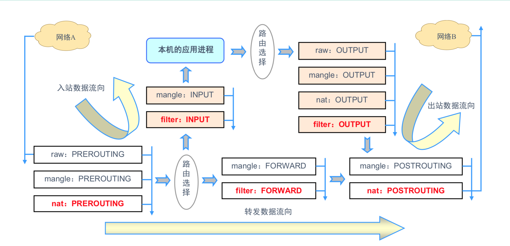
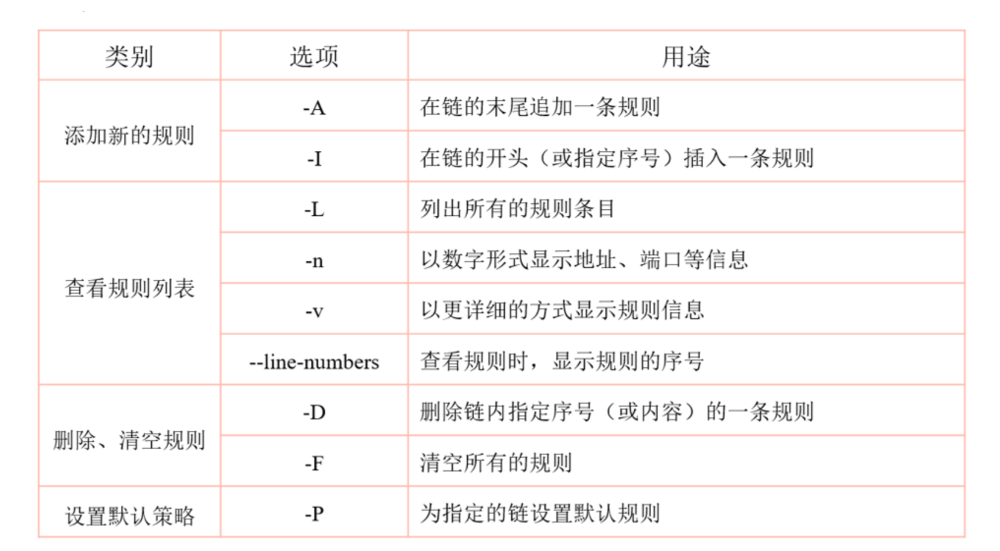

### 1、什么是防火墙？

工作在主机边缘处或者网络边缘处对数据报文进行检测，并且能够根据事先定 义好的规则，对数据报文进行相应处理的模块 

### 2. 防火墙的分类 

##### 构造

硬件:深信服 网御 华为 

软件:windows 防火墙、 iptables

#####  工作机制 

包过滤防火墙:SIPDIPSPORTDPORT 

应用层防火墙:URL HOSTNAME 

##### 模块 

应用态 

iptables 

内核态 

netfilter 

### 3. iptables原理

#### 五链

INPUT:处理入站数据包 	1

OUTPUT:处理出站数据包 	2

FORWARD:处理转发数据包 	3

PREROUTING链:在进行路由选择前处理数据包 4

POSTROUTING链:在进行路由选择后处理数据包 	5

#### 四表

raw 表:确定是否对该数据包进行状态跟踪 

mangle 表:为数据包设置标记 

nat 表:修改数据包中的源、目标IP地址或端口 

filter 表:确定是否放行该数据包(过滤) 

#### 防火墙顺序

raw — mangle — nat — filter 

#### 链顺序

入站:

- PREROUTING 
- INPUT

出站:

	- OUTPUT 
	- POSTROUTING 

转发:

	- PREROUTING
	- FORWARD 
	- POSTROUTING 

#### 规则顺序

- 按顺序依次检查，匹配即停止(LOG策略例外) 

- 若找不到相匹配规则，则按该链的默认策略处理

#### 数据匹配流程图



#### Iptables 语法规则

语法构成 

```bash
iptables [-t 表名] 选项 [链名] [条件] [-j 控制类型] 
```

**几个注意事项** 

- 不指定表名时，默认指filter表
- 不指定链名时，默认指表内的所有链
- 除非设置链的默认策略，否则必须指定匹配条件
- 选项、链名、控制类型使用大写字母，其余均为小写 

#### 常见动作类型

- ACCEPT:允许通过 

- DROP:直接丢弃，不给出任何回应 

- REJECT:拒绝通过，必要时会给出提示 

- LOG:记录日志信息，然后传给下一条规则继续匹配 

- SNAT:修改数据包源地址 

- DNAT:修改数据包目的地址 

- REDIRECT:重定向 

#### 添加新规则

**-A**:在链的末尾追加一条规则

**-I**:在链的开头(或指定序号)插入一条规则 

```bash
iptables -t filter -A INPUT -p tcp -j ACCEPT 

iptables -I INPUT -p udp -j ACCEPT 

iptables -I INPUT 2 -p icmp -j ACCEPT
```

#### 查看规则列表

- -L:列出所有的规则条目 

- -n:以数字形式显示地址、端口等信息 

- -v:以更详细的方式显示规则信息 --line-numbers:查看规则时，显示规则的序号 

```bash
iptables -L INPUT --line-numbers

```

#### 删除、清空规则 

- -D:删除链内指定序号(或内容)的一条规则 

- -F:清空所有的规则 

`默认规则只能是ACCEPT和DROP,别的没有意义`

```bash
iptables -D INPUT 3
iptables -n -L INPUT
```

#### 设置默认策略 

- -P:为指定的链设置默认规则 

```bash
iptables -t filter -P FORWARD DROP
iptables -P OUTPUT ACCEPT
```



#### 匹配类型

##### 通用匹配 

​	可直接使用，不依赖于其他条件或扩展 

​	包括网络协议、IP地址、网络接口等条件 

##### 隐含匹配

 	要求以特定的协议匹配作为前提 

​	包括端口、TCP标记、ICMP类型等条件 

##### 显式匹配

 	要求以“-m 扩展模块”的形式明确指出类型 

​	 包括多端口、MAC地址、IP范围、数据包状态等条件 

#### 通用匹配

##### 常见的通用匹配条件 

- 协议匹配:-p 协议名
- 地址匹配:-s 源地址、-d 目的地址 
- 接口匹配:-i 入站网卡、-o 出站网卡 

```bash
iptables -A FORWARD -s 192.168.1.11 -j REJECT
iptables -I INPUT -s 10.20.30.0/24 -j DROP
iptables -I INPUT -p icmp -j DROP
iptables -A FORWARD -p ! icmp -j ACCEPT
iptables -A INPUT -i eth1 -s 172.16.0.0/12 -j DROP
```

#### 隐含匹配 

##### 常用的隐含匹配条件 

端口匹配: --sport 源端口、--dport 目的端口 

ICMP类型匹配: --icmp-type ICMP类型 

```bash
iptables -A FORWARD -s 192.168.4.0/24 -p udp --dport 53 -j ACCEPT
iptables -A INPUT -p tcp --dport 20:21 -j ACCEPT 
iptables -A INPUT -p icmp --icmp-type 8 -j DROP
iptables -A INPUT -p icmp --icmp-type 0 -j ACCEPT 
iptables -A INPUT -p icmp --icmp-type 3 -j ACCEPT 
iptables -A INPUT -p icmp -j DROP
```

#### 显示匹配

##### 常用的显式匹配条件 

- 多端口匹配:-m multiport --sport 源端口列表 -m multiport --dport 目的端口列表 

- IP范围匹配:-m iprange --src-range IP范围 

- MAC地址匹配:-m mac –mac1-source MAC地址 状态匹配:-m state --state 连接状态 

```bash
iptables -A INPUT -p tcp -m multiport --dport 25,80,110,143 - j ACCEPT
iptables -A FORWARD -p tcp -m iprange --src-range 192.168.4.21-192.168.4.28 -j ACCEPT
iptables -A INPUT -m mac --mac-source 00:0c:29:c0:55:3f -j DROP
iptables -P INPUT DROP
iptables -I INPUT -p tcp -m multiport --dport 80-82,85 -j ACCEPT
iptables -I INPUT -p tcp -m state --state NEW,ESTABLISHED,RELATED -j ACCEPT
```

#### SNAT

##### SNAT策略的典型应用环境

局域网主机共享单个公网IP地址接入Internet

##### SNAT策略的原理

源地址转换，Source Network Address Translation 修改数据包的源地址

##### 前提条件
- 局域网各主机正确设置IP地址/子网掩码
- 局域网各主机正确设置默认网关地址
- Linux网关支持IP路由转发
- 实现方法:编写SNAT转换规则

```bash

# -o 指定的是外网网卡
iptables -t nat -A POSTROUTING -s 10.10.10.0/24 -o eth1 -j SNAT --to-source 192.168.43.32
```

##### MASQUERADE 

##### 地址伪装 

- 适用于外网 IP地址 非固定的情况 
- 对于ADSL 拨号连接，接口通常为 ppp0、ppp1 
- 将SNAT规则改为 MASQUERADE 即可 

```bash
# -o 指定的是外网网卡
iptables -t nat -A POSTROUTING -s 10.10.10.0/24 -o eth1 -j MASQUERADE 
```

#### DNAT

##### DNAT策略的典型应用环境 

​	在Internet中发布位于企业局域网内的服务器 

##### DNAT策略的原理

 目标地址转换，Destination Network Address Translation 修改数据包的目标地址 

##### 前提条件 

- 局域网的Web服务器能够访问Internet 

- 网关的外网IP地址有正确的DNS解析记录 

- Linux网关支持IP路由转发 

##### 实现方法 

编写DNAT转换规则 

```bash
# -i 指定入网网卡（外网）
iptables -t nat -A PREROUTING -i eth1 -d 192.168.43.12 -p tcp --dport 80 -j DNAT --to-destination 10.10.10.11
```

##### 发布时修改目标端口 

在DNAT规则中以“IP:Port”的形式指定目标地址 

```bash
iptables -t nat -A PREROUTING -i eth0 -d 218.29.30.31 -p tcp --dport 2346 -j DNAT --to-destination 192.168.1.6:22
```

#### 持久化导出备份

##### 持久化

```bash
service iptables save
```


导出(备份)规则:

​	iptables-save工具 可结合重定向输出保存到指定文件 

```
iptables-save > iptables.conf
```


##### 导入(还原)规则:

​	iptables-restore工具 可结合重定向输入指定规则来源 

```
iptables-save < iptables.conf
```

##### iptables服务 

脚本位置:/etc/init.d/iptables 

规则文件位置:/etc/sysconfig/iptables 


#### 其他

```bash
# 22端口默认设置配置任何规则之前先配置sshd服务，否则链接就断掉了
iptables -t filter -A INPUT -s 10.10.10.0/24 -p tcp  --dport 22 -j ACCEPT
iptables -t filter -P INPUT DROP
# 允许自己ping别人 不允许别人ping你
# 3级别 主机不可达 0级别回写放行 因为icmp是双向协议
iptables -t filter -I INPUT -p icmp --icmp-type 3 -j ACCEPT
iptables -t filter -I INPUT -p icmp --icmp-type 0 -j ACCEPT
iptables -t filter -A INPUT -p icmp -DROP
```

