## 常用密码技术

### 信息安全面临的威胁


## 对称加密

> "对称加密: 也称为对称密码, 是指在加密和解码时使用同一秘钥的加密方式"


### DES

#### 什么是DES

> **DES(Data Encryption Standard)**是1977年美国联邦信息处理标准(FIPS)中所采用的一种对称密码 (FIPS46.3)。DES一直以来被美国以及其他国家的政府和银行等广泛使用。然而，随着计算机的进步，现在 DES已经能够被暴力破解，强度大不如前了。

#### 加密和解密

> DES是一种将64比特的明文加密成64比特的密文的对称密码算法， <font color="24a061" >**它的密钥长度是56比特 。**</font><font color="dc544b">**尽管从规格上来 说，DES的密钥长度是64比特，但由于每隔7比特会设置一个用于错误检查的比特，因此实质上其密钥长度是56 比特。DES是以64比特的明文(比特序列)为一个单位来进行加密的，** </font>**这个64比特的单位称为分组** 。一般来说，以分 组为单位进行处理的密码算法称为 分组密码(blockcipher) ，DES就是分组密码的一种。
>
> DES每次只能加密64比特的数据，如果要加密的明文比较长，就需要对DES加密进行迭代(反复)，而迭代的具 体方式就称为模式(mode)。


### 三重DES

> 现在DES已经可以在现实的时间内被暴力破解，因此我们需要一种用来替代DES的分组密码，三重DES就是出于 这个目的被开发出来的。
>
> **三重DES(triple-DES)是为了增加DES的强度， 将DES重复3次所得到的一种密码算法 ，通常缩写为3DES。**

####  三重DES的加密

> 三重DES的加解密机制如图所示:


> 明文经过三次DES处理才能变成最后的密文，**由于 DES密钥的长度实质上是56比特** ，因此 <font color="red" >**三重DES的密钥长度就 是56×3=168比特, 加上用于错误检测的标志位8x3, 共192bit**</font>。
>
> 从上图我们可以发现，三重DES并不是进行三次DES加密(加密-->加密-->加密)，而是 <font color="red" >**加密-->解密-->加密**</font> 的过 程。在加密算法中加人解密操作让人感觉很不可思议，实际上这个方法是IBM公司设计出来的，目的是为了让三 重DES能够兼容普通的DES。
>
> <font color="24a061" >**当三重DES中所有的密钥都相同时，三重DES也就等同于普通的DES了。**</font>这是因为在前两步加密-->解密之后，得 到的就是最初的明文。因此，以前用DES加密的密文，就可以通过这种方式用三重DES来进行解密。也就是说， 三重DES对DES具备向下兼容性。
>
> 如果密钥1和密钥3使用相同的密钥，而密钥2使用不同的密钥(也就是只使用两个DES密钥)，这种三重DES就 称为DES-EDE2。EDE表示的是加密(Encryption) -->解密(Decryption)-->加密(Encryption)这个流程。
>
> 密钥1、密钥2、密钥3全部使用不同的比特序列的三重DES称为DES-EDE3。

> 尽管三重DES目前还被银行等机构使用，但其处理速度不高，而且在安全性方面也逐渐显现出了一些问题。

### AES

> 和DES—样，AES算法也是由多个轮所构成的，下图展示了每一轮的大致计算步骤。DES使用Feistel网络作为其基 本结构，而AES没有使用Feistel网络，而是使用了SPN Rijndael的输人分组为128比特，也就是16字节。首先，需 要逐个字节地对16字节的输入数据进行SubBytes处理。所谓SubBytes,就是以每个字节的值(0~255中的任意 值)为索引，从一张拥有256个值的替换表(S-Box)中查找出对应值的处理，也是说，将一个1字节的值替换成 另一个1字节的值。
>
> SubBytes之后需要进行ShiRows处理，即将SubBytes的输出以字节为单位进行打乱处理。从下图的线我们可以 看出，这种打乱处理是有规律的。
>
> ShiRows之后需要进行MixCo1umns处理，即对一个4字节的值进行比特运算，将其变为另外一个4字节值。 最后，需要将MixColumns的输出与轮密钥进行XOR，即进行AddRoundKey处理。到这里，AES的一轮就结東了。
>
> 实际上，在AES中需要重复进行10 ~ 14轮计算。
>
> 通过上面的结构我们可以发现输入的所有比特在一轮中都会被加密。和每一轮都只加密一半输人的比特的Feistel 网络相比，这种方式的优势在于加密所需要的轮数更少。此外，这种方式还有一个优势，即SubBytes， ShiRows和MixColumns可以分别按字节、行和列为单位进行并行计算。


> SubBytes -- 字节代换 
>
> ShiRows -- 行移位代换 
>
> MixColumns -- 列混淆 
>
> AddRoundKey -- 轮密钥加

### 应选择哪种对称加密

> 前面我们介绍了DES、三重DES和AES等对称密码，那么我们到底应该使用哪一种对称密码算法呢?
>
> 1. 今后最好不要将DES用于新的用途，因为随着计算机技术的进步，现在用暴力破解法已经能够在现实的时 间内完成对DES的破译。但是，在某些情况下也需要保持与旧版本软件的兼容性。
>
> 2. 出于兼容性的因素三重DES在今后还会使用一段时间，但会逐渐被AES所取代。
> 3. 今后大家应该使用的算法是AES(Rijndael)，因为它安全、快速，而且能够在各种平台上工作。此外，
>
> 由于全世界的密码学家都在对AES进行不断的验证，因此即便万一发现它有什么缺陷，也会立刻告知全世 界并修复这些缺陷。
>
> 一般来说，我们不应该使用任何自制的密码算法，而是应该使用AES。因为AES在其选定过程中，经过了全世界 密码学家所进行的高品质的验证工作，而对于自制的密码算法则很难进行这样的验证。

### 分组密码

```
"分组密码的模式 -- 分组密码是如何迭代的"
```

> 我们将探讨一下分组密码的模式 
>
> 我们在上一章中介绍的DES和AES都属于分组密码，它们只能加密固定长度的明文。如果需要加密任意长度的明文，就需要对分组密码进行迭代，而分组密码的迭代方法就称为分组密码的“模式”。
>
>  分组密码有很多种模式，如果模式的选择不恰当，就无法保证机密性。例如，如果使用ECB模式，明文中的一些规律就可以通过密文被识别出来。 
>
> 分组密码的主要模式(ECB、CBC、CFB、OFB、CTR)，最后再来考察一下到底应该使用哪一种模式。

#### 分组密码

> **分组密码(blockcipher)** 是每次只能处理特定长度的一块数据的一类密码算法，这里的一块"就称为分组 (block)。此外，一个分组的比特数就称为分组长度(blocklength)。
>
> 例如， **DES和三重DES的分组长度都是64比特** 。这些密码算法一次只能加密64比特的明文.并生成64比特的密 文。
>
> **AES的分组长度可以从128比特、192比特和256比特中进行选择。当选择128比特的分组长度时，AES一次可加密 128比特的明文，并生成128比特的密文。**

#### 模式

> 推荐使用Crt和CBC
>
> 模式有很多种类，分组密码的主要模式有以下5种:
>
> ECB模式:Electronic Code Book mode(电子密码本模式)
>
> CBC模式:Cipher Block Chaining mode(密码分组链接模式) 
>
> CFB模式:Cipher FeedBack mode(密文反馈模式) 
>
> OFB模式:Output FeedBack mode(输出反馈模式)
>
> CTR模式:CounTeR mode(计数器模式)


###  对称加密的弊端

> - 秘钥分发困难
> - 可以通过非对称加密完成秘钥的分发

## 非对称加密

```
"非对称加密也叫公钥密码: 使用公钥加密, 使用私钥解密"
```


> 在对称密码中，由于**加密和解密的密钥是相同**的，因此必须向接收者配送密钥。用于解密的密钥必须被配送给接收者，这一问题称为密钥配送问题。
>
> 如果使用非对称加密也可以称为公钥密码，则无需向接收者配送用于解密的密钥，这样就解决了密钥配送问题。可以说非对称加密是密码学历史上最伟大的发明。
>
> 非对称加密中，密钥分为加密密钥和解密密钥两种。发送者用加密密钥对消息进行加密，接收者用解密密钥对密文进行解密。要理解公钥密码，清楚地区分加密密钥和解密密钥是非常重要的。加密密钥是发送者加密时使用的，而解密密钥则是接收者解密时使用的。
>
> 仔细思考一下加密密钥和解密密钥的区别，我们可以发现:
>   - 发送者只需要加密密钥
>   - 接收者只需要解密密钥
>   - 解密密钥不可以被窃听者获取
>   - 加密密钥被窃听者获取也没问题
>
> ```
> 也就是说，解密密钥从一开始就是由接收者自己保管的，因此只要将加密密钥发给发送者就可以解决密钥配送
> 问题了，而根本不需要配送解密密钥。
> ```
>
> 非对称加密中，加密密钥一般是公开的。正是由于加密密钥可以任意公开，因此该密钥被称为 公钥 (publickey) 。公钥可以通过邮件直接发送给接收者，也可以刊登在报纸的广告栏上，做成看板放在街上，或 者做成网页公开给世界上任何人，而完全不必担心被窃听者窃取。
>
> ```
> 当然，我们也没有必要非要将公钥公开给全世界所有的人，但至少我们需要将公钥发送给需要使用公钥进行加
> 密的通信对象(也就是给自己发送密文的发送者)。
> ```
>
> 相对地， 解密密钥是绝对不能公开的，这个密钥只能由你自己来使用，因此称为私钥(privatekey) 。私钥不可 以被别人知道，也不可以将它发送给别人，甚至也不能发送给自己的通信对象。
>
> 公钥和私钥是一一对应的，一对公钥和私钥统称为 密钥对(keypair) 。由公钥进行加密的密文，必须使用与该 公钥配对的私钥才能够解密。密钥对中的两个密钥之间具有非常密切的关系(数学上的关系)一一因此公钥和私钥 是不能分别单独生成的。
>
> ```
> 公钥密码的使用者需要生成一个包括公钥和私钥的密钥对，其中公钥会被发送给别人，而私钥则仅供自己使
> 用。稍后我们将具体尝试生成一个密钥对。
> ```


### RSA

> 非对称加密的密钥分为加密密钥和解密密钥，但这到底是怎样做到的呢?本节中我们来讲解现在使用最广泛的 公钥密码算法一一RSA。
>
> RSA是一种非对称加密算法，它的名字是由它的三位开发者，即RonRivest、AdiShamir和LeonardAdleman 的姓氏 的首字母组成的(Rivest-Shamir-Leonard)。
>
> RSA可以被用于非对称加密和数字签名，关于数字签名我们将在后面章节进行讲解。 1983年，RSA公司为RSA算法在美国取得了专利，但现在该专利已经过期。
>
> 在RSA中，加密和解密的形式是相同的。加密是求 "E次方的mod N”，而解密则是求 "D次 方的modN” ，这真是太美妙了。
>
> 当然，D也并不是随便什么数都可以的，作为解密密钥的D，和数字E有着相当紧密的联系。否则，用E加密的结 果可以用D来解密这样的机制是无法实现的。
>
> 顺便说一句， D是解密〈Decryption)的首字母，N是数字(Number)的首字母 。 我们将上面讲过的内容整理一下，如下表所示。


###  ECC椭圆曲线

> 1. 概念
>     椭圆曲线密码学(英语:Elliptic curve cryptography，缩写为 ECC)，一种建立公开密钥加密的算法，基
>
>    于椭圆曲线数学。椭圆曲线在密码学中的使用是在1985年由Neal Koblitz和Victor Miller分别独立提出的。 ECC的主要优势是在某些情况下它比其他的方法使用更小的密钥——比如RSA加密算法——提供相当的或更
>
>    高等级的安全。
>
>    椭圆曲线密码学的许多形式有稍微的不同，所有的都依赖于被广泛承认的解决椭圆曲线离散对数问题的 困难性上。与传统的基于大质数因子分解困难性的加密方法不同，ECC通过椭圆曲线方程式的性质产生密 钥。
>
>    ECC 164位的密钥产生的一个安全级相当于RSA 1024位密钥提供的保密强度，而且计算量较小，处理速度 更快，存储空间和传输带宽占用较少。目前我国 居民二代身份证 正在使用 256 位的椭圆曲线密码，虚拟 货币 比特币 也选择ECC作为加密算法。
>
>    具体算法详解参考:
>
>    https://www.cnblogs.com/Kalafinaian/p/7392505.html
>
>    https://blog.csdn.net/taifei/article/details/73277247
>
> 2. 数学原理 不管是RSA还是ECC或者其它，公钥加密算法都是依赖于某个正向计算很简单(多项式时间复杂度)，而
>
>    逆向计算很难(指数级时间复杂度)的数学问题。 椭圆曲线依赖的数学难题是:
>
>    k为正整数，P是椭圆曲线上的点(称为基点), k*P=Q , 已知Q和P，很难计算出k

### 非对称加密解惑 

#### 非对称加密比对称加密机密性更高吗?

> 这个问题无法回答, 以为机密性高低是根据秘钥长度而变化的

#### 采用1024bit 秘钥长度的非对称加密, 和采用128bit秘钥长度的对称加密中, 是秘钥更长的非对称加密更安全吗?

> 不是。
>
> 非对称加密的密钥长度不能与对称加密的密钥长度进行直接比较。下表是一张密钥长度的比较表(本表摘 自《应用密码学》)，根据这张表我们可以看出，1024比特的公钥密码与128比特的对称密码相比，反而是 128比特的对称密码抵御暴力破解的能力更强。

| 对称加密秘钥长度 | 非对称加密秘钥长度 |
| :--------------: | :----------------: |
|     128 比特     |     2304 比特      |
|     112 比特     |     1792 比特      |
|     80 比特      |      768 比特      |
|     64 比特      |      512 比特      |
|     56 比特      |      384 比特      |

#### 有了非对称加密， 以后对称加密会被替代吗?

> 不会。
>
> 一般来说，在采用具备同等机密性的密钥长度的情况下，非对称加密的处理速度只有对称加密的几百分之
> 一。因此，非对称加密并不适合用来对很长的消息内容进行加密。根据目的的不同，还可能会配合使用对
> 称加密和非对称加密，例如，混合密码系统就是将这两种密码组合而成的。

#### 谁就拿私钥,谁拿公钥匙

> 数据对谁更重要, 谁就拿私钥
>
> 一对多的时候，一的一方拿私钥

### 总结

> 非对称加密的秘钥 不存在秘钥分发困难的问题

## 单向散列函数

```
单向散列函数 --- 获取消息的指纹"
```

> 单向散列函数(one-waynction)有一个输人和一个输出，其中输人称为消息(message)，输出称为散列值 (hashvalue)。单向散列函数可以根据消息的内容计算出散列值，而散列值就可以被用来检查消息的完整性。

### 单向散列函数的实际应用

#### 检测软件是否被篡改

#### 消息认证码

> 使用单向散列函数可以构造消息认证码。
>
> 消息认证码是将“发送者和接收者之间的共享密钥”和“消息，进行混合后计算出的散列值。使用消息认证码可以 检测并防止通信过程中的错误、篡改以及伪装。
>
> 消息认证码在SSL/TLS中也得到了运用，关于SSL/TLS我们将后边章节中介绍。

#### 数字签名

> 在进行数字签名时也会使用单向散列函数。
>
> 数字签名是现实社会中的签名(sign)和盖章这样的行为在数字世界中的实现。数字签名的处理过程非常耗时， 因此一般不会对整个消息内容直接施加数字签名，而是先通过单向散列函数计算出消息的散列值，然后再对这 个散列值施加数字签名。

#### 伪随机数生成器

> 使用单向散列函数可以构造伪随机数生成器。
>
> 密码技术中所使用的随机数需要具备“事实上不可能根据过去的随机数列预测未来的随机数列”这样的性质。为 了保证不可预测性，可以利用单向散列函数的单向性。

#### 一次性口令

> 使用单向散列函数可以构造一次性口令(one-time password)。
>
> 一次性口令经常被用于服务器对客户端的合法性认证。在这种方式中，通过使用单向散列函数可以保证口令只 在通信链路上传送一次(one-time)，因此即使窃听者窃取了口令，也无法使用。

### 常用的单向散列函数

#### MD5

> MD5是由Rwest于1991年设计的单项散列函数，能够产生128比特的散列值(RFC1321)。 MD5的强抗碰撞性已经被攻破，也就是说，现在已经能够产生具备相同散列值的两条不同的消息，因此它也已经不安全了。
>
> MD5中的MD是消息摘要(Message Digest)的缩写。

##### SHA-1、SHA-224、SHA-256、SHA-384、SHA-512

> SHA-1是由NIST(NationalInstituteOfStandardsandTechnology，美国国家标准技术研究所)设计的一种能够产生 160比特的散列值的单向散列函数。1993年被作为美国联邦信息处理标准规格(FIPS PUB 180)发布的是 SHA,1995年发布的修订版FIPS PUB 180-1称为SHA-1。
>
> SHA-1的消息长度存在上限，但这个值接近于264比特，是个非常巨大的数值，因此在实际应用中没有问题。
>
> SHA-256、SHA-384和SHA-512都是由NIST设计的单向散列函数，它们的散列值长度分别为256比特、384比特和
>
> 512比特。这些单向散列函数合起来统称SHA-2，它们的消息长度也存在上限(SHA-256的上限接近于 264 比特，
>
> SHA-384 和 SHA-512的上限接近于 2128 比特)。这些单向散列函数是于2002年和 SHA-1 一起作为 FIPS PUB 180-2 发布的 SHA-1 的强抗碰撞性已于2005年被攻破, 也就是说，现在已经能够产生具备相同散列值的两条不同的消 息。不过，SHA-2还尚未被攻破。

|         | 比特数 | 字节数 |
| :-----: | :----: | :----: |
|   MD4   | 128bit | 16byte |
|   MD5   | 128bit | 16byte |
|  SHA-1  | 160bit | 20byte |
| SHA-224 | 224bit | 28byte |
| SHA-256 | 256bit | 32byte |
| SHA-384 | 384bit | 48byte |
| SHA-512 | 512bit | 64byte |

## 消息认证码

```
"消息认证码 --- 消息被正确传送了吗?"
```

###  什么是消息认证码

> 像以前一样，我们还是从一个Alice和Bob的故事开始讲起。不过，这一次Alice和Bob分别是两家银行，Alice 银行通过网络向Bob银行发送了一条汇款请求，Bob银行收到的请求内容是:


> 当然，Bob银行所收到的汇款请求内容必须与Alice银行所发送的内容是完全一致的。如果主动攻击者 Mallory在中途将Alice银行发送的汇款请求进行了篡改，那么Bob银行就必须要能够识别出这种篡改，否则 如果Mallory将收款账户改成了自己的账户，那么1000万元就会被盗走。
>
> 话说回来，这条汇款请求到底是不是Alice银行发送的呢?有可能Alice银行根本就没有发送过汇款请求，而 是由主动攻击者Mallory伪装成Alice银行发送的。如果汇款请求不是来自Alice银行，那么就绝对不能执行汇 款。
>
> 现在我们需要关注的问题是汇款请求(消息)的 “完整性" 和 “认证" 这两个性质。
>
> **消息的完整性(integrity), 指的是“消息没有被篡改"这一性质，完整性也叫一致性。**如果能够确认汇款请 求的内容与Alice银行所发出的内容完全一致，就相当于是确认了消息的完整性，也就意味着消息没有被篡 改。
>
> **消息的认证(authentication)指的是“消息来自正确的发送者"这一性质 。**如果能够确认汇款请求确实来自 Alice银行，就相当于对消息进行了认证，也就意味着消息不是其他人伪装成发送者所发出的。
>
> 通过使用本章中要介绍的消息认证码，我们就可以同时识别出篡改和伪装，也就是既可以确认消息的完整
> 性，也可以进行认证。

#### 什么是消息认证码

> 消息认证码(message authentication code)是一种确认完整性并进行认证的技术，取三个单词的首字 母，简称为MAC。
>
> 消息认证码的输入包括任意长度的消息和一个发送者与接收者之间 **共享的密钥** ，它可以输出固定长度的数 据，这个数据称为 MAC值 。
>
> ```
> 根据任意长度的消息输出固定长度的数据，这一点和单向散列函数很类似。但是单向散列函数中计算散列
> 值时不需要密钥，而消息认证码中则需要使用发送者与接收者之间共享的密钥。
> ```
>
> 要计算MAC必须持有共享密钥，没有共享密钥的人就无法计算MAC值，消息认证码正是利用这一性质来完 成认证的。此外，和单向散列函数的散列值一样，哪怕消息中发生1比特的变化，MAC值也会产生变化，消 息认证码正是利用这一性质来确认完整性的。
>
> ```
> 消息认证码有很多种实现方法，大家可以暂且这样理解:消息认证码是一种与密钥相关联的单向散列函
> 数。
> ```

#### 单向散列函数与消息认证码的比较

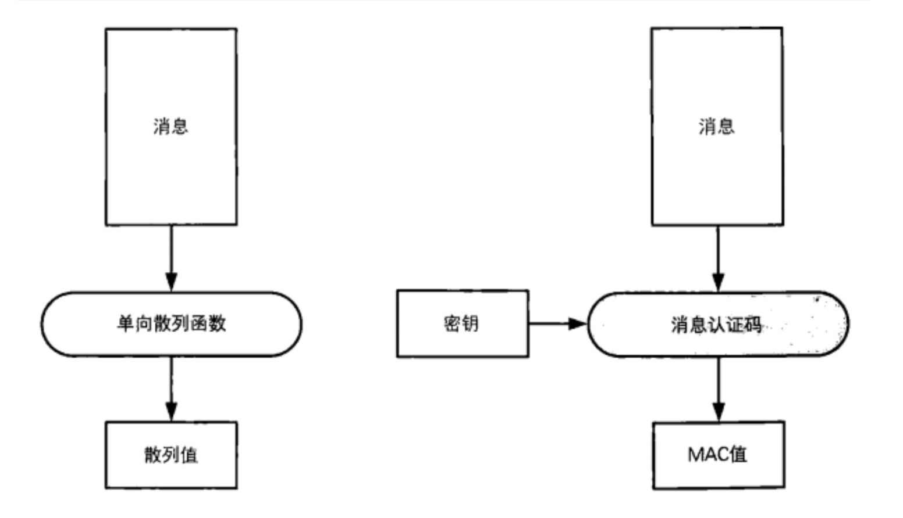

### 消息认证码的使用步骤


> 1. 发送者Alice与接收者Bob事先共享密钥。
>
> 2. 发送者Alice根据汇款请求消息计算MAC值(使用共享密钥)。
>
> 3. 发送者Alice将汇款请求消息和MAC值两者发送给接收者Bob。
>
> 4. 接收者Bob根据接收到的汇款请求消息计算MAC值(使用共享密钥)。
>
> 5. 接收者Bob将自己计算的MAC值与从Alice处收到的MAC值进行对比。
>
> 6. 如果两个MAC值一致，则接收者Bob就可以断定汇款请求的确来自Alice(认证成功);如果不一致，则可
>
>    以断定消息不是来自Alice(认证失败)。

###  HMAC

> HMAC是一种使用单向散列函数来构造消息认证码的方法(RFC2104)，其中HMAC的H就是Hash的意思。 HMAC中所使用的单向散列函数并不仅限于一种，任何高强度的单向散列函数都可以被用于HMAC,如果将来设计
>
> 出新的单向散列函数，也同样可以使用。 使用SHA-I、MD5、RIPEMD-160所构造的HMAC，分别称为HMAC-SHA-1、HMAC-MD5和HMAC-RlPEMD。
>
> 最后得到的MAC值，一定是一个和输入的消息以及密钥都相关的长度固定的比特 序列。

### 无法解决的问题

#### 密钥配送问题

> 在消息认证码中，需要发送者和接收者之间共享密钥，而这个密钥不能被主动攻击者Mallory获取。如果这个密 钥落入Mallory手中，则Mallory也可以计算出MAC值，从而就能够自由地进行篡改和伪装攻击，这样一来消息认 证码就无法发挥作用了。
>
> 发送者和接收者需要共享密钥，这一点和我们介绍的对称加密很相似。实际上，对称加密的密钥配送问题在消息认证码中也同样会发生。关于秘钥的配送后边章节会介绍如何使用非对称加密的方式进行解决。

#### 第三方证明

> 假设发送者Alice要向接收者Bob发送消息，如果使用了消息认证码，接收者Bob就能够断定自己收到的消息与发 送者Alice所发出的消息是一致的，这是因为消息中的MAC值只有用Alice和Bob之间共享的密钥才能够计算出来， 即便主动攻击者Mallory篡改消息，或者伪装成Alice发送消息，Bob也能够识别出消息的篡改和伪装。
>
> 但是，消息认证码也不能解决所有的问题，例如“对第三方证明"和“防止否认"，这两个问题就无法通过消息认证 码来解决。下面我们来逐一解释一下。

#### 对第三方证明

> 假设Bob在接收了来自Alice的消息之后，想要向第三方验证者Victor证明这条消息的确是Alice发送的，但是用消 息认证码无法进行这样的证明，这是为什么呢?
>
> 首先，Victor要校验MAC值，就需要知道Alice和Bob之间共享的密钥。
>
> 假设Bob相信Victor, 同意将密钥告诉Victor,即便如此，Victor也无法判断这条消息是由Alice发送的，因为Victor可 以认为:“即使MAC值是正确的，发送这条消息的人也不一定是Alice，还有可能是Bob。"
>
> 能够计算出正确MAC值的人只有Alice和Bob，在他们两个人之间进行通信时，可以断定是对方计算了MAC值，这 是因为共享这个密钥的双方之中，有一方就是自己。然而，对于第三方Victor、Alice或Bob却无法证明是对方计 算了MAC值，而不是自己。
>
> 解决办法是使用将要介绍的数字签名就可以实现对第三方的证明。

#### 防止否认

> 假设Bob收到了包含MAC值的消息，这个MAC值是用Alice和Bob共享的密钥计算出来的，因此Bob能够判断这条消 息的确来自Alice。
>
> 但是，上面我们讲过，Bob无法向验证者Victor证明这一点，也就是说，发送者Alice可以向Victor声称:“我没有 向Bob发送过这条消息。”这样的行为就称为否认(repudiation)。
>
> Alice可以说“这条消息是Bob自己编的吧"，“说不定Bob的密钥被主动攻击者Mallory给盗取了，我的密钥可是妥善 保管着呢" 等。说白了，就是Alice和Bob吵起来了。
>
> 即便Bob拿MAC值来举证，Victor也无法判断Alice和Bob谁的主张才是正确的，也就是说， 用消息认证码**无法防止 否认(nonrepudiatlon) 。**

### 总结

> 消息认证码是对消息进行认证并确认其完整性的技术。通过使用发送者和接收者之间共享的密钥，就可以识别出是否存在伪装和篡改行为。
>
> 消息认证码可以使用单向散列函数HMAC， 对称加密也可以实现， 这里不再进行介绍。
>
> 消息认证码中，由于发送者和接收者共享相同的密钥，因此会产生无法对第三方证明以及无法防止否认等问题。在下一章中，我们将介绍能够解决这些问题的数字签名。

## 数字签名

```
"数字签名 --- 消息到底是谁写的"
```

> 我们将学习数字签名的相关知识。数字签名是一种将相当于现实世界中的盖章、签字的功能在计算机世
> 界中进行实现的技术。使用数字签名可以识别篡改和伪装，还可以防止否认。

### 从消息认证到数字签名

#### 消息认证码的局限性

> 通过介绍的消息认证码，我们可以识别消息是否被篡改或者发送者身份是否被伪装，也就是可 以校验消息的完整性，还可以对消息进行认证。然而，比如在出具借条的场景中却无法使用消息认证码， 因为消息认证码无法防止否认。
>
> 消息认证码之所以无法防止否认，是因为消息认证码需要在发送者Alice和接收者Bob两者之间共享同一个 密钥。正是因为密钥是共享的，所以能够使用消息认证码计算出正确MAC值的并不只有发送者Alice，接收 者Bob也可以计算出正确的MAC值。由于Alice和Bob双方都能够计算出正确的MAC值，因此对于第三方来 说，我们无法证明这条消息的确是由Alice生成的。

### 通过数字签名解决问题

> 下面请大家开动一下脑筋。假设发送者Alice和接收者Bob不需要共享一个密钥，也就是说，Alice和Bob各自 使用不同的密钥。
>
> 我们假设Alice使用的密钥是一个只有Alice自己才知道的私钥。当Alice发送消息时，她用私钥生成一个“签 名"。相对地，接收者Bob则使用一个和Alice不同的密钥对签名进行验证。使用Bob的密钥无法根据消息生 成签名，但是用Bob的密钥却可以对Alice所计算的签名进行验证，也就是说可以知道这个签名是否是通过 Alice的密钥计算出来的。如果真有这么一种方法的话，那么不管是识别篡改、伪装还是防止否认就都可以 实现了吧 ?
>
> 实际上，这种看似很神奇的技术早就已经问世了，这就是数字签名(digital signat.ure)。

### 签名的生成和验证

> 让我们来稍微整理一下。
> <font color="#508ff2">**在数字签名技术中，出现了下面两种行为:**</font>
>
> - 生成消息签名的行为
> - 验证消息签名的行为
>
> **生成消息签名** 
>
> 这一行为是由消息的发送者Alice来完成的，也称为“对消息签名”。生成签名就是根据消息内容计 算数字签名的值，这个行为意味着 “我认可该消息的内容"。
>
> **验证数字签名** 
>
> 这一行为一般是由消息的接收者Bob来完成的，但也可以由需要验证消息的第三方来完成，这里 的第三方我们暂且将其命名为验证者Victor。验证签名就是检查该消息的签名是否真的属于Alice，验证的结果可 以是成功或者失败，成功就意味着这个签名是属于Alice的，失败则意味着这个签名不是属于Alice的。
>
> ```
> 在数字签名中，生成签名和验证签名这两个行为需要使用各自专用的密钥来完成。
> ```
>
> Alice使用“签名密钥"来生成消息的签名，而Bob和Victor则使用“验证密钥"来验证消息的签名。数字签名对签名密 钥和验证密钥进行了区分，使用验证密钥是无法生成签名的。这一点非常重要。此外， **签名密钥只能由签名的 人持有 ，而 验证密钥则是任何需要验证签名的人都可以持有 。**
>
> 刚才讲的这部分内容，是不是觉得似曾相识呢?
> 没错，这就是我们讲过的非对称加密。公钥密码和上面讲的数字签名的结构非常相似。在非对称加密中，密钥分为**加密密钥**和**解密密钥**，用加密密钥无法进行解密。此外，解密密钥只能由需要解密的人持有，而加密密钥则是任何需要加密的人都可以持有。你看，数字签名和非对称加密是不是很像呢?
>
> 实际上，数字签名和非对称加密有着非常紧密的联系，简而言之，数字签名就是通过将非对称加密 “反过来用” 而实现的。下面我们来将密钥的使用方式总结成一张表:


|             | **私钥**             | 公钥                       |
| ----------- | -------------------- | -------------------------- |
| 非对称加密  | 接收者解密时使用     | 发送者加密时使用           |
| 数字签名    | 签名者生成签名时使用 | 验证者验证签名时使用       |
| 谁持有秘钥? | 个人持有             | 只要需要，任何人都可以持有 |

### 非对称加密和数字签名

> ```
> 下面我们再来详细讲一讲非对称加密与数字签名之间的关系。
> ```
>
> 要实现数字签名，我们可以使用之前介绍的非对称加密。非对称加密包括一个由公钥和私钥组成的密钥对， 其中公钥用于加密，私钥用于解密。

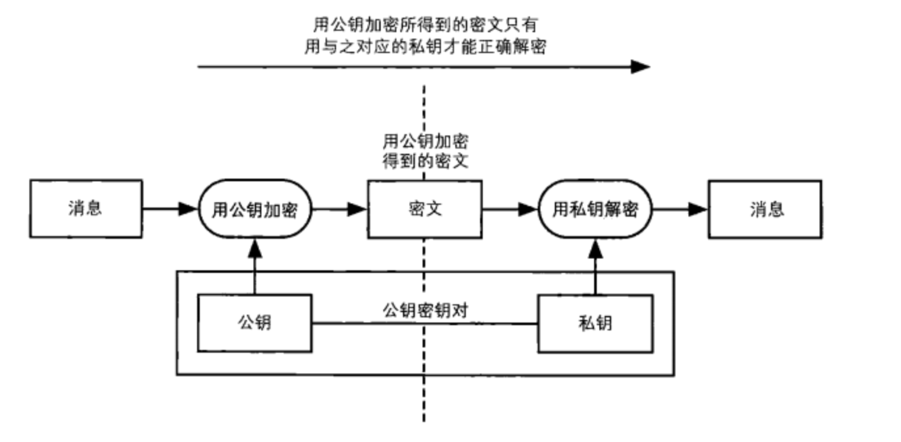

> 数字签名中也同样会使用公钥和私钥组成的密钥对，不过这两个密钥的用法和非对称加密是相反的，即用私钥 加密相当于生成签名，而用公钥解密则相当于验证签名。请大家通过比较两张图示来理解一下“反过来用”到底 是什么样的情形。 	

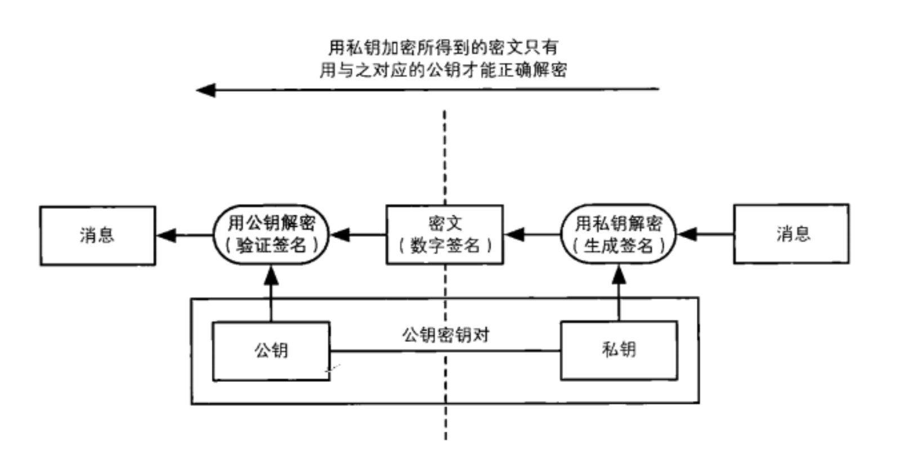

> 那么为什么加密相当于生成签名，而解密相当于验证签名呢?要理解这个问题，我们需要回想一下非对称加密中讲过的知识，即组成密钥对的两个密钥之间存在严密的数学关系，它们是一对无法拆散的伙伴。
>
> 用公钥加密所得到的密文，只能用与该公钥配对的私钥才能解密:同样地，用私钥加密所得到的密文，也只能用与该私钥配对的公钥才能解密。也就是说，如果用某个公钥成功解密了密文，那么就能够证明这段密文是用与该公钥配对的私钥进行加密所得到的。
>
> 用私钥进行加密这一行为只能由持有私钥的人完成，正是基于这一事实，我们才可以将用私钥加密的密文作为签名来对待。
>
> 由于公钥是对外公开的，因此任何人都能够用公钥进行解密，这就产生了一个很大的好处，即任何人都能够对签名进行验证。

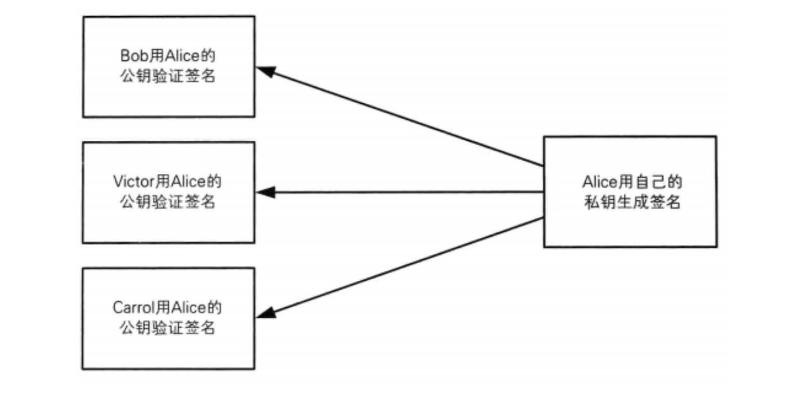

### 数字签名的方法

> 下面我们来具体介绍两种生成和验证数字签名的方法。
>
> - 直接对消息签名的方法
> - 对消息的散列值签名的方法
>
> 直接对消息签名的方法比较容易理解，但实际上并不会使用;对消息的散列值签名的方法稍微复杂一点，但实际中我们一般都使用这种方法。
>
> 使用直接对消息签名的方法，需要对整个消息进行加密，非常耗时，这是因为非对称加密算法本来就非常慢。那么，我们能不能生成一条很短的数据来代替消息本身呢?这就是单向散列函数。
>
> 于是我们不必再对整个消息进行加密(即对消息签名)，而是只要**先用单向散列函数求出消息的散列值，然后**
> **再将散列值进行加密(对散列值签名)就可以了。**无论消息有多长，散列值永远都是这么短，因此对其进行加
> 密(签名)是非常轻松的。
>
> **(1)Alice用单向散列函数计算消息的散列值。** 
>
> **(2)Alice用自己的私钥对散列值进行加密。**
>
> ```
> 用私钥加密散列值所得到的密文就是Alice对这条散列值的签名，由于只有Alice才持有自己的私钥因此, 除了Alice以外，其他人是无法生成相同的签名(密文)的。
> ```
>
> **(3)Alice将消息和签名发送给Bob。** 
>
> **(4)Bob用Alice的公钥对收到的签名进行解密。**
>
> ```
> 如果收到的签名确实是用Alice的私钥进行加密而得到的密文(签名)，那么用Alice的公钥应该能够正确解密，解密的结果应该等于消息的散列值。
> 
> 如果收到的签名不是用Alice的私钥进行加密而得到的密文， 那么就无法用Alice的公钥正确解密(解密后得到的数据看起来是随机的)。
> ```
>
> **(5)Bob将签名解密后得到的散列值与Alice直接发送的消息的散列值进行对比。**
>
> ```
>  如果两者一致，则签名验证成功;如果两者不一致，则签名验证失败
> ```
>
> 我们将数字签名中生成签名和验证签名的过程整理成一张时间流程图 。	

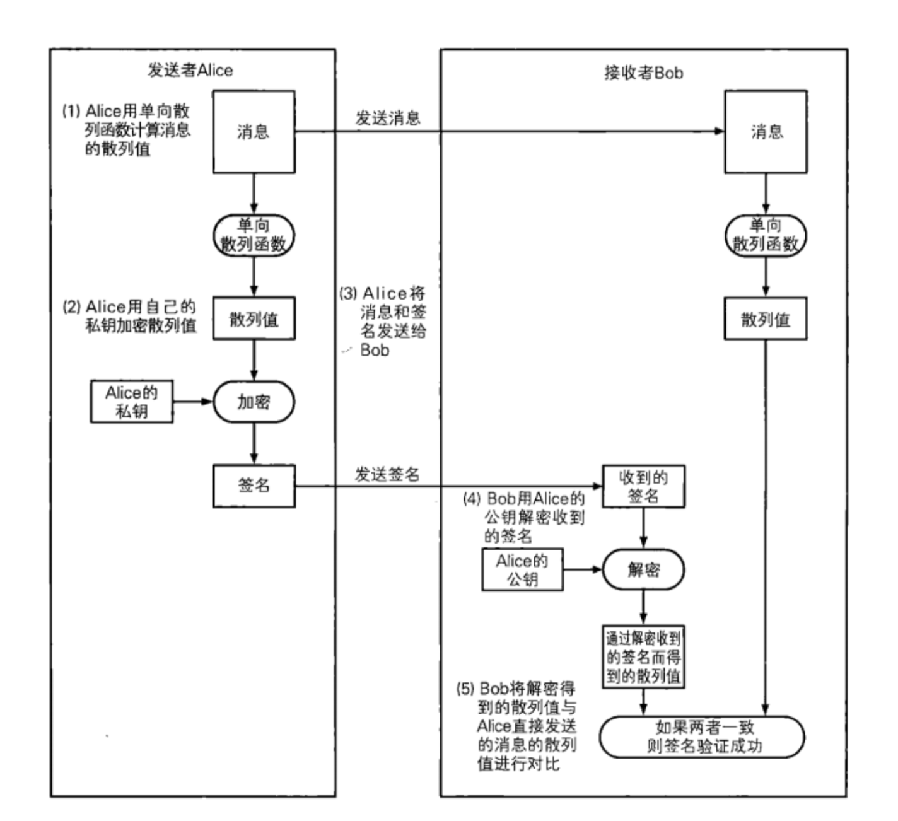


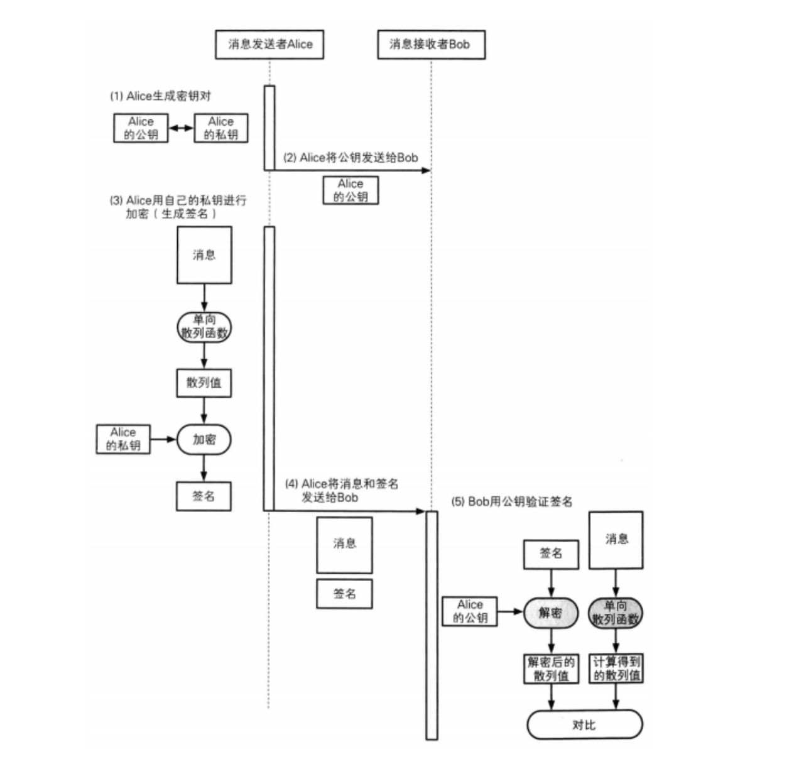

### 数字签名无法解决的问题

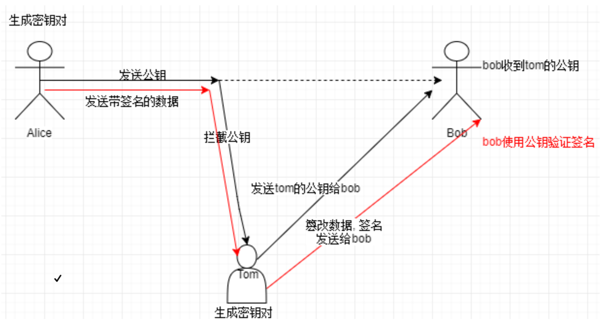

> ```
> 用数字签名既可以识别出篡改和伪装，还可以防止否认。也就是说，我们同时实现了确认消息的完整性、进行
> 认证以及否认防止。现代社会中的计算机通信从这一技术中获益匪浅。
> ```
>
> 然而， 要正确使用数字签名，有一个大前提，那是用于**验证签名的公钥必须属于真正的发送者**即公钥是可信的。 即便数字签名 算法再强大，如果你得到的公钥是伪造的，那么数字签名也会完全失效。
>
> ```
> 现在我们发现自己陷人了一个死循环一一一数字签名是用来识别消息篡改、伪装以及否认的，但是为此我们又
> 必须从没有被伪装的发送者得到没有被篡改的公钥才行。
> 
> 为了能够确认自己得到的公钥是否合法，我们需要使用证书。
> 
> 所谓证书，就是将公钥当作一条消息，由一个可信的第三方对其签名后所得到的公钥。
> ```
>
> 当然，这样的方法只是把问题转移了而已。为了对证书上施加的数字签名进行验证，我们必定需要另一个公 钥，那么如何才能构筑一个可信的数字签名链条呢?又由谁来颁发可信的证书呢?到这一步，我们就已经踏人 了社会学的领域。
>
> 我们需要让公钥以及数字签名技术成为一种社会性的基础设施，即公钥基础设施(Public Key Intrastructure)，简称PKIO关于证书和PKI我们将在之后介绍。

## 证书

```
"证书 -- 为公钥加上数字签名"
```

> ```
> 要开车得先考驾照.驾照上面记有本人的照片、姓名、出生日期等个人信息.以及有效期、准驾车辆的类型等
> 信息，并由公安局在上面盖章。我们只要看到驾照，就可以知道公安局认定此人具有驾驶车辆的资格。
> ```
>
> **公钥证书(Public-Key Certificate，PKC)**其实和驾照很相似，里面记有姓名、组织、邮箱地址等个人信息，以及 属于此人的公钥，并由认证机构(Certification Authority、Certifying Authority, CA)施加数字签名。只要看到公 钥证书，我们就可以知道认证机构认定该公钥的确属于此人。公钥证书也简称为证书(certificate)。
>
> 可能很多人都没听说过认证机构，认证机构就是能够认定 “公钥确实属于此人"，并能够生成数字签名的个人或 者组织。认证机构中有国际性组织和政府所设立的组织，也有通过提供认证服务来盈利的一般企业，此外个人 也可以成立认证机构。

### 证书的应用场景

> 下面我们来通过证书的代表性应用场景来理解证书的作用。 下图展示了Alice向Bob发送密文的场景，在生成密文时所使用的Bob的公钥是通过认证机构获取的。
>
> 认证机构必须是可信的，对于“可信的第三方”，下图中会使用Trent这个名字，这个词是从trust(信任)一词演 变而来的。

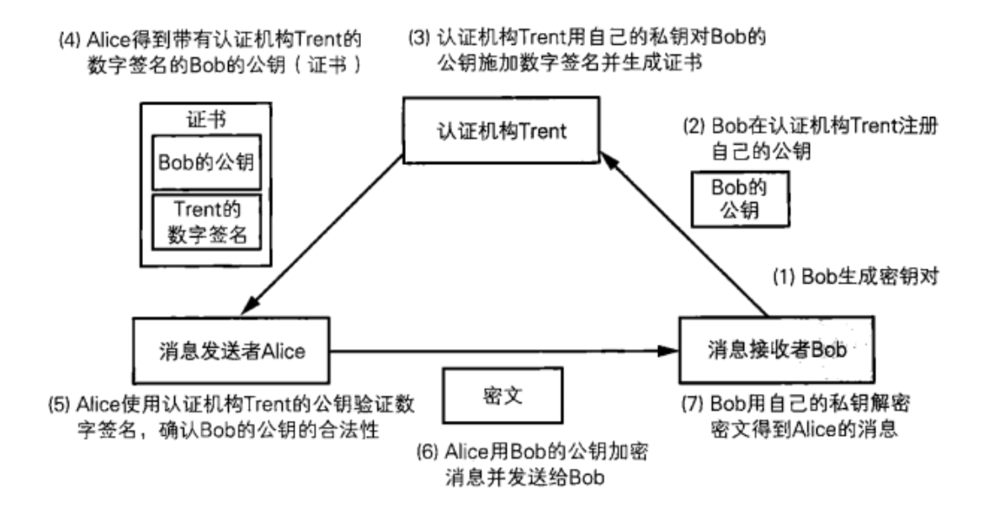

> ```
> 下面让我们对照着上图来看一看这些步骤具体都做了些什么。
> ```
>
> 1. **<font color="#dc524a">Bob生成密钥对 </font>**
>
>    要使用公钥密码进行通信，首先需要生成密钥对。
>
>    Bob生成了一对公钥和私钥，并将私钥自行妥善保管。
>
>    在这里，密钥对是由Bob自己生成的，也可以由认证机构代为生成。 
>
> 2. **<font color="#dc524a">Bob在认证机构Trent注册自己的公钥</font>**
>    - 在这里Bob则将公钥发送给了认证机构Trent，这是因为Bob需要请认证机构Trent对他的公钥加上数字签名(也就是生成证书)。
>    - Trent收到Bob的公钥后，会确认所收到的公钥是否为Bob本人所有(参见专栏:身份确认和认证业 务准则)
>
> 
>
> > ​    **<font color="#239f60">专栏:身份确认和认证业务准则</font>**
> >
> > 认证机构确认"本人"身份的方法和认证机构的认证业务准则(CertificatePractice Statement, CPS，的内容有关。如果认证机构提供的是测试用的服务，那么可能完全不会进行任何身份确 认。如果是政府部门运營的认证机构，可能就需要根据法律规定来进行身份确认。如果是企业 面向内部设立的认证机构，那就可能会给部门负责人打电话直接确认。
> >
> > 例如，VeriSign的认证业务准则中将身份确认分为Class1 ~ 3共三个等级
> >
> > - Class1:通过向邮箱发送件来确认本人身份 
> > - Class2:通过第三方数据库来确认本人身份 
> > - Class3:通过当面认证和身份证明来确认本人身份
>
> ```
>        等级越高，身份确认越严格。
> ```
>
> 3. **<font color="#dc524a">认证机构Trent用自己的私钥对Bob的公钥施加数字签名并生成证书</font>**
>
>     Trent对Bob的公钥加上数字签名。为了生成数字签名，需要Trent自身的私钥，因此Trent需要事先生成好密钥对。
>
> 4. **<font color="#dc524a">Alice得到带有认证机构Trent的数字签名的Bob的公钥(证书) </font>**
>
>    现在Alice需要向Bob发送密文，因此她从Trent处获取证书。证书中包含了Bob的公钥。
>
> 5. **<font color="#dc524a">Alice使用认证机构Trent的公钥验证数字签名，确认Bob的公钥的合法性 </font>**
>
>    Alice使用认证机构Trent的公钥对证书中的数字签名进行验证。如果验证成功，就相当于确认了证书中所包含的公钥的确是属于Bob的。到这里，Alice就得到了合法的Bob的公钥。
>
> 6. **<font color="#dc524a">Alice用Bob的公钥加密消息并发送给Bob</font>**
>
>    Alice用Bob的公钥加密要发送的消息，并将消息发送给Bob。
>
> 7. **<font color="#dc524a">Bob用自己的私钥解密密文得到Alice的消息</font>**
>
>    Bob收到Alice发送的密文，然后用自己的私钥解密，这样就能够看到Alice的消息了。
>
> **<font color="508ef2">上面就是利用认证机构Trent进行公钥密码通信的流程。其中1、2、3这几个步骤 仅在注册新公钥时才会进行，并不是每次通信都需要。此外，步骤 4 仅在Alice第 一次用公钥密码向Bob发送消息时才需要进行，只要Alice将Bob的公钥保存在电 脑中，在以后的通信中就可以直接使用了。</font>**

### 证书标准规范X.509

> 证书是由认证机构颁发的，使用者需要对证书进行验证，因此如果证书的格式千奇百怪那就不方便了。于是， 人们制定了证书的标准规范，其中使用最广泛的是由ITU(International TelecommumcationUnion，国际电信联 盟)和ISO(IntemationalOrganizationforStandardization, 国际标准化组织)制定的X.509规范。很多应用程序都支 持x.509并将其作为证书生成和交换的标准规范。
>
> X.509是一种非常通用的证书格式。所有的证书都符合ITU-T X.509国际标准，因此(理论上)为一种应用创建的证书 可以用于任何其他符合X.509标准的应用。X.509证书的结构是用ASN1(Abstract Syntax Notation One)进行描述数据 结构，并使用ASN.1语法进行编码。
>
> 在一份证书中，必须证明公钥及其所有者的姓名是一致的。对X.509证书来说，认证者总是 CA 或由CA指定的 人，一份X.509证书是一些标准字段的集合，这些字段包含有关用户或设备及其相应公钥的信息。X.509标准定义 了证书中应该包含哪些信息，并描述了这些信息是如何编码的(即数据格式)
>
> 一般来说，一个数字证书内容可能包括基本数据(版本、序列号) 、所签名对象信息( 签名算法类型、签发者信 息、有效期、被签发人、签发的公开密钥)、CA的数字签名，等等。

#### 证书规范

> 前使用最广泛的标准为ITU和ISO联合制定的X.509的 v3版本规范 (RFC5280), 其中定义了如下证书信息域:
>
> **版本号(Version Number):**
>
> ​	规范的版本号，目前为版本3，值为0x2;
> **序列号(Serial Number):**
>
> ​	由CA维护的为它所发的每个证书分配的一的列号，用来追踪和撤销证书。只要 拥有签发者信息和序列号，就可以唯一标识一个证书，最大不能过20个字节;
>
> **签名算法(Signature Algorithm):**
>
> 数字签名所采用的算法，如: sha256-with-RSA-Encryption
>
> ccdsa-with-SHA2S6;
>  颁发者(Issuer):发证书单位的标识信息，如 ” C=CN，ST=Beijing, L=Beijing, O=org.example.com，
>
> CN=ca.org。example.com ”;
>
> **有效期(Validity):** 
>
> 证书的有效期很，包括起止时间。
>
> **主体(Subject) :** 
>
> 证书拥有者的标识信息(Distinguished Name)，如:" C=CN，ST=Beijing, L=Beijing, CN=person.org.example.com”;
>
> **主体的公钥信息(SubJect Public Key Info):**
>
> 所保护的公钥相关的信息:
>
> - 公钥算法 (Public Key Algorithm)公钥采用的算法;
>
> - 主体公钥(Subject Unique Identifier):公钥的内容。
>
> **颁发者唯一号(Issuer Unique Identifier):**
>
> 代表颁发者的唯一信息，仅2、3版本支持，可选;
>
> **主体唯一号(Subject Unique Identifier):**
>
> 代表拥有证书实体的唯一信息，仅2，3版本支持，
>
> **可选: 扩展(Extensions，可选):** 
>
> 可选的一些扩展。中可能包括:
>
> - Subject Key Identifier:实体的秘钥标识符，区分实体的多对秘钥; 
>
> - Basic Constraints:一指明是否属于CA;
> -  Authority Key Identifier:证书颁发者的公钥标识符;
> -  CRL Distribution Points: 撤销文件的颁发地址;
>
> Key Usage:证书的用途或功能信息。 此外，证书的颁发者还需要对证书内容利用自己的私钥添加签名， 以防止别人对证书的内容进行篡改。

#### 证书格式

> X.509规范中一般推荐使用PEM(Privacy Enhanced Mail)格式来存储证书相关的文件。证书文件的文件名后缀一般 为 .crt 或 .cer 。对应私钥文件的文件名后缀一般为 .key。证书请求文件的文件名后綴为 .csr 。有时候也统一用 pem作为文件名后缀。
>
> PEM格式采用文本方式进行存储。一般包括首尾标记和内容块，内容块采用Base64进行编码。 编码格式总结:
>
> - X.509 DER(Distinguished Encoding Rules)编码，后缀为:.der .cer .crt 
>
> - X.509 BASE64编码(PEM格式)，后缀为:.pem .cer .crt
>
> 例如，一个PEM格式(base64编码)的示例证书文件内容如下所示:

```properties
-----BEGIN CERTIFICATE-----
MIIDyjCCArKgAwIBAgIQdZfkKrISoINLporOrZLXPTANBgkqhkiG9w0BAQsFADBn
MSswKQYDVQQLDCJDcmVhdGVkIGJ5IGh0dHA6Ly93d3cuZmlkZGxlcjIuY29tMRUw
EwYDVQQKDAxET19OT1RfVFJVU1QxITAfBgNVBAMMGERPX05PVF9UUlVTVF9GaWRk
bGVyUm9vdDAeFw0xNzA0MTExNjQ4MzhaFw0yMzA0MTExNjQ4MzhaMFoxKzApBgNV
BAsMIkNyZWF0ZWQgYnkgaHR0cDovL3d3dy5maWRkbGVyMi5jb20xFTATBgNVBAoM
DERPX05PVF9UUlVTVDEUMBIGA1UEAwwLKi5iYWlkdS5jb20wggEiMA0GCSqGSIb3
DQEBAQUAA4IBDwAwggEKAoIBAQDX0AM198jxwRoKgwWsd9oj5vI0and9v9SB9Chl
gZEu6G9ZA0C7BucsBzJ2bl0Mf6qq0Iee1DfeydfEKyTmBKTafgb2DoQE3OHZjy0B
QTJrsOdf5s636W5gJp4f7CUYYA/3e1nxr/+AuG44Idlsi17TWodVKjsQhjzH+bK6
8ukQZyel1SgBeQOivzxXe0rhXzrocoeKZFmUxLkUpm+/mX1syDTdaCmQ6LT4KYYi
soKe4f+r2tLbUzPKxtk2F1v3ZLOjiRdzCOA27e5n88zdAFrCmMB4teG/azCSAH3g
Yb6vaAGaOnKyDLGunW51sSesWBpHceJnMfrhwxCjiv707JZtAgMBAAGjfzB9MA4G
A1UdDwEB/wQEAwIEsDATBgNVHSUEDDAKBggrBgEFBQcDATAWBgNVHREEDzANggsq
LmJhaWR1LmNvbTAfBgNVHSMEGDAWgBQ9UIffUQSuwWGOm+o74JffZJNadjAdBgNV
HQ4EFgQUQh8IksZqcMVmKrIibTHLbAgLRGgwDQYJKoZIhvcNAQELBQADggEBAC5Y
JndwXpm0W+9SUlQhAUSE9LZh+DzcSmlCWtBk+SKBwmAegbfNSf6CgCh0VY6iIhbn
GlszqgAOAqVMxAEDlR/YJTOlAUXFw8KICsWdvE01xtHqhk1tCK154Otci60Wu+tz
1t8999GPbJskecbRDGRDSA/gQGZJuL0rnmIuz3macSVn6tH7NwdoNeN68Uj3Qyt5
orYv1IFm8t55224ga8ac1y90hK4R5HcvN71aIjMKrikgynK0E+g45QypHRIe/z0S
/1W/6rqTgfN6OWc0c15hPeJbTtkntB5Fqd0sfsnKkW6jPsKQ+z/+vZ5XqzdlFupQ
29F14ei8ZHl9aLIHP5s=
-----END CERTIFICATE-----
```

#### 证书中的解析出来的内容:

```yml
Certificate:
    Data:
G2
    Version: 3 (0x2)
    Serial Number:
        10:e6:fc:62:b7:41:8a:d5:00:5e:45:b6
Signature Algorithm: sha256WithRSAEncryption
    Issuer: C=BE, O=GlobalSign nv-sa, CN=GlobalSign Organization Validation CA-SHA256-
    Validity
        Not Before: Nov 21 08:00:00 2016 GMT
        Not After : Nov 22 07:59:59 2017 GMT
        Subject: C=US, ST=California, L=San Francisco, O=Wikimedia Foundation, Inc.,
CN=*.wikipedia.org
        Subject Public Key Info:
            Public Key Algorithm: id-ecPublicKey
                Public-Key: (256 bit)
                pub:
                    04:c9:22:69:31:8a:d6:6c:ea:da:c3:7f:2c:ac:a5:
                    af:c0:02:ea:81:cb:65:b9:fd:0c:6d:46:5b:c9:1e:
                    ed:b2:ac:2a:1b:4a:ec:80:7b:e7:1a:51:e0:df:f7:
                    c7:4a:20:7b:91:4b:20:07:21:ce:cf:68:65:8c:c6:
                    9d:3b:ef:d5:c1
     ASN1 OID: prime256v1
                NIST CURVE: P-256
        X509v3 extensions:
            X509v3 Key Usage: critical
                Digital Signature, Key Agreement
            Authority Information Access:
                CA Issuers -
URI:http://secure.globalsign.com/cacert/gsorganizationvalsha2g2r1.crt
                OCSP - URI:http://ocsp2.globalsign.com/gsorganizationvalsha2g2
            X509v3 Certificate Policies:
                Policy: 1.3.6.1.4.1.4146.1.20
                  CPS: https://www.globalsign.com/repository/
                Policy: 2.23.140.1.2.2
            X509v3 Basic Constraints:
                CA:FALSE
            X509v3 CRL Distribution Points:
                Full Name:
                  URI:http://crl.globalsign.com/gs/gsorganizationvalsha2g2.crl
            X509v3 Subject Alternative Name:
                DNS:*.wikipedia.org, DNS:*.m.mediawiki.org, DNS:*.m.wikibooks.org,
DNS:*.m.wikidata.org, DNS:*.m.wikimedia.org, DNS:*.m.wikimediafoundation.org,
DNS:*.m.wikinews.org, DNS:*.m.wikipedia.org, DNS:*.m.wikiquote.org,
DNS:*.m.wikisource.org, DNS:*.m.wikiversity.org, DNS:*.m.wikivoyage.org,
DNS:*.m.wiktionary.org, DNS:*.mediawiki.org, DNS:*.planet.wikimedia.org,
DNS:*.wikibooks.org, DNS:*.wikidata.org, DNS:*.wikimedia.org,
DNS:*.wikimediafoundation.org, DNS:*.wikinews.org, DNS:*.wikiquote.org,
DNS:*.wikisource.org, DNS:*.wikiversity.org, DNS:*.wikivoyage.org, DNS:*.wiktionary.org,
DNS:*.wmfusercontent.org, DNS:*.zero.wikipedia.org, DNS:mediawiki.org, DNS:w.wiki,
DNS:wikibooks.org, DNS:wikidata.org, DNS:wikimedia.org, DNS:wikimediafoundation.org,
DNS:wikinews.org, DNS:wikiquote.org, DNS:wikisource.org, DNS:wikiversity.org,
DNS:wikivoyage.org, DNS:wiktionary.org, DNS:wmfusercontent.org, DNS:wikipedia.org
            X509v3 Extended Key Usage:
                TLS Web Server Authentication, TLS Web Client Authentication
            X509v3 Subject Key Identifier:
                28:2A:26:2A:57:8B:3B:CE:B4:D6:AB:54:EF:D7:38:21:2C:49:5C:36
            X509v3 Authority Key Identifier:
                keyid:96:DE:61:F1:BD:1C:16:29:53:1C:C0:CC:7D:3B:83:00:40:E6:1A:7C
    Signature Algorithm: sha256WithRSAEncryption
         8b:c3:ed:d1:9d:39:6f:af:40:72:bd:1e:18:5e:30:54:23:35:
         ...
```

### CA证书

> ```
> 证书是用来证明某某东西确实是某某东西的东西(是不是像绕口令?)。通俗地说，证书就好比上文里面的公
> 章。通过公章，可以证明对应的证件的真实性。
> ```
>
> 理论上，人人都可以找个证书工具，自己做一个证书。那如何防止坏人自己制作证书出来骗人捏?请看后续 CA 的介绍。
>
> CA是Certificate Authority的缩写，也叫“证书授权中心”。
>
> 它是负责管理和签发证书的第三方机构, 好比一个可信任的中介公司。一般来说，CA必须是所有行业和所有公众 都信任的、认可的。因此它必须具有足够的权威性。就好比A、B两公司都必须信任C公司，才会找 C 公司作为公 章的中介。

#### CA证书

> CA 证书，顾名思义，就是CA颁发的证书。 前面已经说了，人人都可以找工具制作证书。但是你一个小破孩制作出来的证书是没啥用处的。因为你不
>
> 是权威的CA机关，你自己搞的证书不具有权威性。
>
> ```
> 比如，某个坏人自己刻了一个公章，盖到介绍信上。但是别人一看，不是受信任的中介公司的公章，就不
> 予理睬。坏蛋的阴谋就不能得逞啦。
> ```

##### 证书信任链

> 证书直接是可以有信任关系的, 通过一个证书可以证明另一个证书也是真实可信的. 实际上，证书之间的信 任关系，是可以嵌套的。比如，C 信任 A1，A1 信任 A2，A2 信任 A3......这个叫做证书的信任链。只要你信 任链上的头一个证书，那后续的证书，都是可以信任滴。
>
> 假设 C 证书信任 A 和 B;然后 A 信任 A1 和 A2;B 信任 B1 和 B2。则它们之间，构成如下的一个树形关系 (一个倒立的树)。

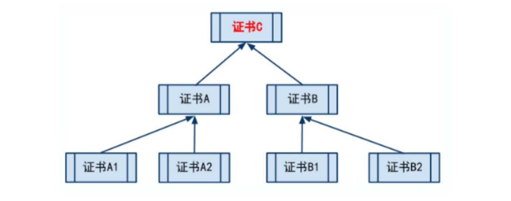

> 处于最顶上的树根位置的那个证书，就是“ 根证书 ”。除了根证书，其它证书都要依靠上一级的证书，来证 明自己。那谁来证明“根证书”可靠捏?实际上，根证书自己证明自己是可靠滴(或者换句话说，根证书是 不需要被证明滴)。
>
> ```
> 聪明的同学此刻应该意识到了:根证书是整个证书体系安全的根本。所以，如果某个证书体系中，根证书
> 出了问题(不再可信了)，那么所有被根证书所信任的其它证书，也就不再可信了。
> ```

##### 证书有啥用

> 1. 验证网站是否可信(针对HTTPS)
> 2. 验证某文件是否可信(是否被篡改)

### 公钥基础设施(PKI)

> 公钥基础设施(Public-Key infrastructure)是为了能够更有效地运用公钥而制定的一系列规范和规格的总称。公 钥基础设施一般根据其英语缩写而简称为PKI。
>
> PKI只是一个总称，而并非指某一个单独的规范或规格。例如，RSA公司所制定的PKCS(Public-Key Cryptography Standards，公钥密码标准)系列规范也是PKI的一种，而互联网规格RFC(Requestfor Comments)中也有很多与 PKI相关的文档。此外，X.509这样的规范也是PKI的一种。在开发PKI程序时所使用的由各个公司编写的 API(Application Programming Interface, 应用程序编程接口)和规格设计书也可以算是PKI的相关规格。
>
> 因此，根据具体所采用的规格，PKI也会有很多变种，这也是很多人难以整体理解PKI的原因之一。
>
> 为了帮助大家整体理解PKI,我们来简单总结一下PKI的基本组成要素(用户、认证机构、仓库)以及认证机构所 负责的工作。

#### PKI的组成要素

> PKI的组成要素主要有以下三个:
>
> 用户 --- 使用PKI的人 
>
> 认证机构 --- 颁发证书的人 
>
> 仓库 --- 保存证书的数据库

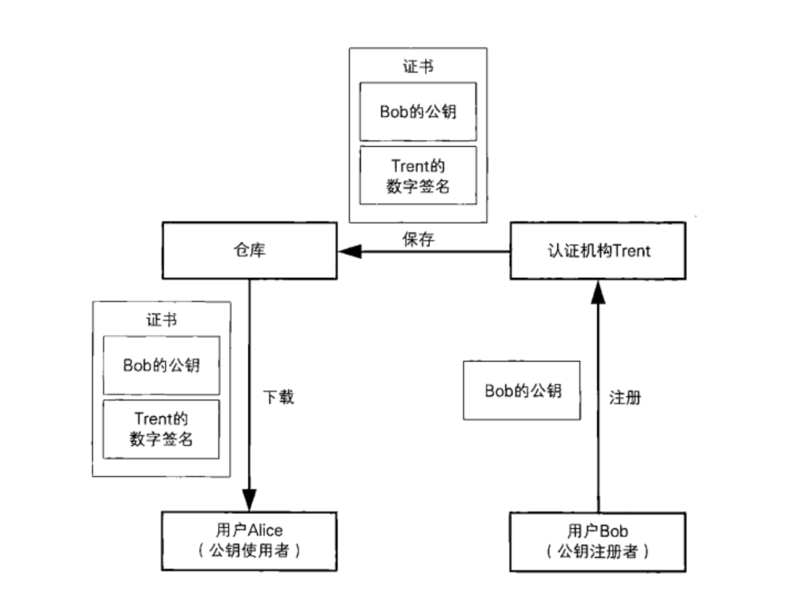

##### 认证机构(CA)

> 认证机构(Certification Authority，CA)是对证书进行管理的人。上面的图中我们给它起了一个名字叫作Trent。 认证机构具体所进行的操作如下:

- 生成密钥对 (也可以由用户生成)

  > 生成密钥对有两种方式:一种是由PKI用户自行生成，一种是由认证机构来生成。在认证机构生成用户密钥 对的情况下，认证机构需要将私钥发送给用户，这时就需要使用PKCS#12(Personal Information Exchange Syntax Standard)等规范。

- 在注册公钥时对本人身份进行认证, 生成并颁发证书

  > 在用户自行生成密钥对的情况下，用户会请求认证机构来生成证书。申请证书时所使用的规范是由 PKCS#10(Certification Request Syntax Standard)定义的。
  >
  > 认证机构根据其认证业务准则(Certification Practice Statement，CPS)对用户的身份进行认证，并生成证 书。在生成证书时，需要使用认证机构的私钥来进行数字签名。生成的证书格式是由PKCS#6 (Extended- Certificate Syntax Standard)和 X.509定义的。

- 作废证书

  > 当用户的私钥丢失、被盗时，认证机构需要对证书进行作废(revoke)。此外，即便私钥安然无恙，有时 候也需要作废证书，例如用户从公司离职导致其失去私钥的使用权限，或者是名称变更导致和证书中记载 的内容不一致等情况。
  >
  > ```
  > 纸质证书只要撕毁就可以作废了，但这里的证书是数字信息，即便从仓库中删除也无法作废，因为用户会
  > 保存证书的副本，但认证机构又不能人侵用户的电脑将副本删除。
  > ```
  >
  > **要作废证书，认证机构需要制作一张证书 作废清单(Certificate Revocation List),简称为CRL 。**

- 仓库

  > 仓库(repository)是一个保存证书的数据库，PKI用户在需要的时候可以从中获取证书.它的作用有点像打电话 时用的电话本。在本章开头的例子中，尽管没特别提到，但Alice获取Bob的证书时，就可以使用仓库。仓库也叫 作证书目录。

## SSL/TLS

```
"SSL/TLS --- 为了更安全的通信"
```

> 本章中我们将学习SSL/TLS的相关知识。 SSL/TLS是世界上应用最广泛的密码通信方法。比如说，当在网上商城中输人信用卡号时，我们的Web浏览器就
>
> 会使用SSL/TLS进行密码通信。使用SSL/TLS可以对通信对象进行认证，还可以确保通信内容的机密性。
>
> SSL/TLS中综合运用了之前所学习的对称密码、消息认证码、公钥密码、数字签名、伪随机数生成器等密码技 术，大家可以在阅读本章内容的同时对这些技术进行复习。
>
> 严格来说，SSL(Secure Socket Layer)与 TLS(Transport Layer Security)是不同的，TLS相当于是SSL的后续版本。不过，本章中所介绍的内容，大多是 SSL和TLS两者兼备的，因此除具体介绍通信协议的部分以外，都统一写作SSL/TLS。
>
> SSL3.0 以后升级为TLS

### 客户端与服务器

> Bob书店是Alice经常光顾的一家网店，因为在Bob书店她可以搜索到新出版的图书，还可以通过信用卡快速完成 支付，购买的书还能快递到家，真的很方便。
>
> 有一天，Alice 读了一本关于网络信息安全的书，书上说“互联网上传输的数据都是可以被窃听的"。Alice感到非 常担心，自己在购买新书的时候输人的信用卡号会不会被窃听呢?
>
> Alice看到Bob书店的网站下面写着一行字:“在以https://开头的网页中输人的信息将通过SSL/TLS发送以确保安 全"。
>
> 的确，输人信用卡号的网页的URL是以 https:// 开头的，而不是一般的 http://。此外.在浏览这个网页时，Alice 的web浏览器上还会显示一个小锁头的图标，看上去好像挺安全的。
>
> 但Alice心想，就算写着“通过SSL/TLS发送”我也不放心啊，到底在我的Web浏览器和Bob书店的网站之间都发生了 哪些事呢?
>
> 本章将要介绍的技术一一SSL/TLS就可以解答Alice的疑问。当进行SSL/TLS通信时，Web浏览器上就会显示一个小 锁头的图标。

#### HTTP通信


> Alice和Bob书店之间的通信，实际上是Alice所使用的Web浏览器和Bob书店的Web服务器之间的通信。Web浏览 器是Alice的计算机上运行的一个程序，而web服务器则是在Bob书店的计算机上运行的一个程序，它们都遵循一 种叫作HTTP(Hyper Text Transfer Protocol, 超文本传输协议)的协议(protocol)来进行通信。其中，Web浏览器 称为HTTP客户端，Web服务器称为HTTP服务器。
>
> 当Alice点击网页上的链接或者输人URL时，Web浏览器就会通过网络向Web服务器发送一个 “我要浏览这个网 页“，的请求(request)。
>
> Web服务器则将请求的网页内容发送给Web浏览器，以便对请求作出响应(response)。服务器和客户端之间所 进行的处理就是请求和响应的往复。HTTP可以认为是在HTTP客户端与HTTP服务器之间进行请求和响应的规 范。
>
> Alice向Bob书店发送信用卡号也是使用HTTP来完成的(下图)。Alice输人信用卡号之后按下提交按钮，这时客 户端(Web浏览器)就会将信用卡号作为HTTP请求发送给服务器。服务器则会将“生成订单"的网页作为HTTP响 应返回给客户端。
>
> ```
> 不过，如果直接发送请求的话，信用卡号就很可能被窃听。
> ```

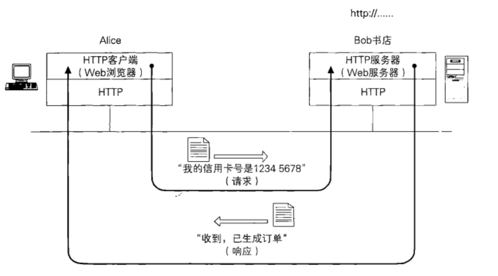

### 用SSL/TLS承载HTTP

> 什么是SSL,什么是TLS呢?官话说SSL是安全套接层(secure sockets layer)，TLS是SSL的继任者，叫传输层安全 (transport layer security)。说白点，就是在明文的上层和TCP层之间加上一层加密，这样就保证上层信息传输的 安全。如HTTP协议是明文传输，加上SSL层之后，就有了雅称HTTPS。它存在的唯一目的就是保证上层通讯安全 的一套机制。
>
> 当Web浏览器发送信用卡号时，信用卡号的数据会作为客户端请求发送给服务器。如果通信内容被窃听者Eve所 窃取，Eve就会得到信用卡号。
>
> 于是，我们可以用SSL(Secure Socket Layer)或者TLS(Transport Layer Security)作为对通信进行加密的协 议，然后在此之上承載HTTP(下图)。通过将两种协议进行叠加，我们就可以对HTTP的通信(请求和响应)进 行加密，从而防止窃听。通过SSL/TLS进行通信时，URL不是以http://开头，而是以https://开头。
>
> 以上就是SSL/TLS的简单介绍。

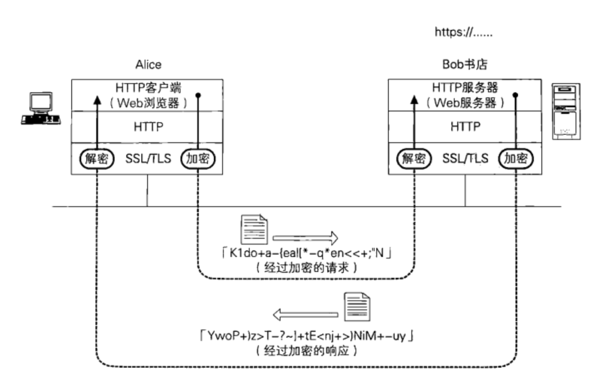

> 在大致了解了SSL/TLS之后，我们来整理一下SSL/TLS到底负责哪些工作。我们想要实现的是，通过本地的浏览 器访问网络上的web服务器，并进行安全的通信。用上边的例子来说就是，Alice希望通过web浏览器向Bob书店 发送信用卡号。在这里，我们有几个必须要解决的问题。
>
> 1. Alice的信用卡号和地址在发送到Bob书店的过程中不能被窃听。 
>
> 2. Alice的信用卡号和地址在发送到Bob书店的过程中不能被篡改。 
>
> 3. 确认通信对方的Web服务器是真正的Bob书店。
>
> 在这里，(1)是机密性的问题;(2)是完整性的问题;而(3)则是认证的问题。
>
> ```
> 要确保机密性，可以使用对称加密。由于对称加密算法的密钥不能被攻击者预测，因此我们使用伪随机数生成
> 器来生成密钥。
> 
> 若要将对称加密的密钥发送给通信对象，可以使用非对称加密算法完成密钥交换。
> 
> 要识别篡改，对数据进行认证，可以使用消息认证码。消息认证码是使用单向散列函数来实现的。
> 
> 要对通信对象进行认证，可以使用对公钥加上数字签名所生成的证书。
> ```
>
> 好，工具已经找齐了，下面只要用一个“框架”(framework)将这些工具组合起来就可以了。SSL/TIS协议其实就 扮演了这样一种框架的角色。

### SSL/TLS也可以保护其他的协议

> 刚才我们提到用SSL/TLS承载HTTP通信，这是因为HTTP是一种很常用的协议。其实SSL/TLS上面不仅可以承载 HTTP，还可以承载其他很多协议。例如，发送邮件时使用的SMTP(Simple Mail Transfer Protocol, 简单邮件传输 协议)和接收邮件时使用的POP3(Post Oice Protocol，邮局协议)都可以用SSL/TLS进行承载。在这样的情况 下，SSL/TLS就可以对收发的邮件进行保护。
>
> 用SSL/TLS承载HTTP、SMTP和POP3的结构如下图所示。一般的电子邮件软件都可以完成发送和接收邮件这两种 操作，其实是同时扮演了SMTP客户端和POP3客户端这两种角色。

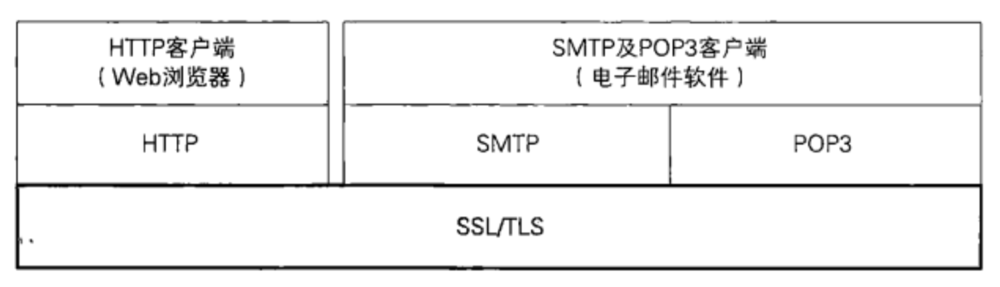

### https

> HTTP协议:是互联网上应用最为广泛的一种网络协议，是一个客户端和服务器端请求和应答的标准(TCP)， 用于从WWW服务器传输超文本到本地浏览器的传输协议，它可以使浏览器更加高效，使网络传输减少。
>
> HTTPS:是以安全为目标的HTTP通道，简单讲是HTTP的安全版，即HTTP下加入SSL/TLS层，HTTPS的安全基础 是SSL/TLS，因此加密的详细内容就需要SSL/TLS。
>
> **<font color="#dc524a">HTTPS协议的主要作用可以分为两种: </font>**
>
> **<font color="#dc524a">建立一个信息安全通道，来保证数据传输的安全;</font>**
>
> **<font color="#dc524a">确认网站的真实性。</font>**
>
> HTTPS和HTTP的区别主要如下: 
>
> 1、https协议需要到ca申请证书，一般免费证书较少，因而需要一定费用。 
>
> 2、http是超文本传输协议，信息是明文传输，https则是具有安全性的ssl/tls加密传输协议。
>
> 3、http和https使用的是完全不同的连接方式，用的端口也不一样，前者是80，后者是443。 
>
> 4、http的连接很简单，是无状态的;HTTPS协议是由SSL/TLS+HTTP协议构建的可进行加密传输身份认证的网络协议，比http协议安全

#### https优缺点

> 尽管HTTPS并非绝对安全，掌握根证书的机构、掌握加密算法的组织同样可以进行中间人形式的攻击，但 HTTPS仍是现行架构下最安全的解决方案，主要有以下几个好处:
>
> 1. 使用HTTPS协议可认证用户和服务器，确保数据发送到正确的客户机和服务器;
> 2. HTTPS协议是由SSL+HTTP协议构建的可进行加密传输、身份认证的网络协议，要比http协议安全，	可防止数据在传输过程中不被窃取、改变，确保数据的完整性。
>
> 3. HTTPS是现行架构下最安全的解决方案，虽然不是绝对安全，但它大幅增加了中间人攻击的成本。
>
> 4. 谷歌曾在2014年8月份调整搜索引擎算法，并称 “比起同等HTTP网站，采用HTTPS加密的网站在搜索结果中的排名将会更高”。

### 单向认证

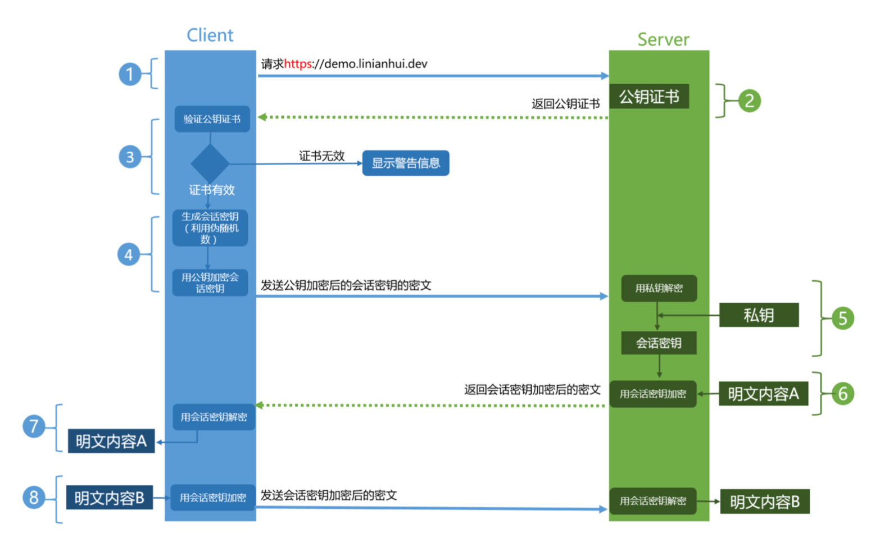

### 双向认证

```
基于单向认证添加一套反向流程就是双向认证
```

### 自签名证书

1. 启动openssl

   ```bash
   openssl # 执行该命令即可
   ```

2. 使用openssl工具生成一个RSA私钥, 注意:生成私钥，需要提供一个至少4位的密码。

   ```bash
   genrsa -des3 -out server.key 2048 
   # - des3: 使用3des对私钥进行加密
   ```

3. 生成CSR(证书签名请求)

   ```bash
   req -new -key server.key -out server.csr
   ```

4. 删除私钥中的密码, 第一步给私钥文件设置密码是必须要做的, 如果不想要可以删掉

   ```bash
   rsa -in server.key -out server.key 
   # -out 参数后的文件名可以随意起
   ```

5. 生成自签名证书

   ```bash
   x509 -req -days 365 -in server.csr -signkey server.key -out server.crt
   ```

## 参考资料

### PKCS15个标准

> PKCS 全称是 Public-Key Cryptography Standards ，是由 RSA 实验室与其它安全系统开发商为促进公钥密码的发 展而制订的一系列标准。
>
> 可以到官网上看看 What is PKCS http://www.rsa.com/rsalabs/node.asp?id=2308

PKCS 目前共发布过 15 个标准:

1. PKCS#1:RSA加密标准。 PKCS#1定义了RSA公钥函数的基本格式标准，特别是数字签名 。它定义了数字签 名如何计算，包括待签名数据和签名本身的格式;它也定义了PSA公/私钥的语法。

2. PKCS#2:涉及了RSA的消息摘要加密，这已被并入PKCS#1中。

3. PKCS#3:Diie-Hellman密钥协议标准。PKCS#3描述了一种实现Diie- Hellman密钥协议的方法。

4. PKCS#4:最初是规定RSA密钥语法的，现已经被包含进PKCS#1中。

5. PKCS#5:基于口令的加密标准。PKCS#5描述了使用由口令生成的密钥来加密8位位组串并产生一个加密的8位

   位组串的方法。PKCS#5可以用于加密私钥，以便于密钥的安全传输(这在PKCS#8中描述)。

6. PKCS#6:扩展证书语法标准。PKCS#6定义了提供附加实体信息的X.509证书属性扩展的语法(当PKCS#6第一

   次发布时，X.509还不支持扩展。这些扩展因此被包括在X.509中)。

7. PKCS#7:密码消息语法标准。PKCS#7为使用密码算法的数据规定了通用语法，比如数字签名和数字信封。

   PKCS#7提供了许多格式选项，包括未加密或签名的格式化消息、已封装(加密)消息、已签名消息和既经过

   签名又经过加密的消息。

8. PKCS#8:私钥信息语法标准。PKCS#8定义了私钥信息语法和加密私钥语法，其中私钥加密使用了PKCS#5标

   准。

9. PKCS#9:可选属性类型。PKCS#9定义了PKCS#6扩展证书、PKCS#7数字签名消息、PKCS#8私钥信息和

   PKCS#10证书签名请求中要用到的可选属性类型。已定义的证书属性包括E-mail地址、无格式姓名、内容类

   型、消息摘要、签名时间、签名副本(counter signature)、质询口令字和扩展证书属性。

10. PKCS#10:证书请求语法标准。PKCS#10定义了证书请求的语法。证书请求包含了一个唯一识别名、公钥和可

    选的一组属性，它们一起被请求证书的实体签名(证书管理协议中的PKIX证书请求消息就是一个 PKCS#10)。

1. PKCS#11:密码令牌接口标准。PKCS#11或“Cryptoki”为拥有密码信息(如加密密钥和证书)和执行密码学函 数的单用户设备定义了一个应用程序接口(API)。智能卡就是实现Cryptoki的典型设备。注意:Cryptoki定 义了密码函数接口，但并未指明设备具体如何实现这些函数。而且Cryptoki只说明了密码接口，并未定义对 设备来说可能有用的其他接口，如访问设备的文件系统接口。

2. PKCS#12:个人信息交换语法标准。PKCS#12定义了个人身份信息(包括私钥、证书、各种秘密和扩展字段) 的格式。PKCS#12有助于传输证书及对应的私钥，于是用户可以在不同设备间移动他们的个人身份信息。

3. PDCS#13:椭圆曲线密码标准。PKCS#13标准当前正在完善之中。它包括椭圆曲线参数的生成和验证、密钥生

   成和验证、数字签名和公钥加密，还有密钥协定，以及参数、密钥和方案标识的ASN.1语法。

4. PKCS#14:伪随机数产生标准。PKCS#14标准当前正在完善之中。为什么随机数生成也需要建立自己的标准

   呢?PKI中用到的许多基本的密码学函数，如密钥生成和Diie-Hellman共享密钥协商，都需要使用随机数。然 而，如果“随机数”不是随机的，而是取自一个可预测的取值集合，那么密码学函数就不再是绝对安全了，因 为它的取值被限于一个缩小了的值域中。因此，安全伪随机数的生成对于PKI的安全极为关键。

5. PKCS#15:密码令牌信息语法标准。 PKCS#15通过定义令牌上存储的密码对象的通用格式来增进密码令牌的 互操作性。在实现PKCS#15的设备上存储的数据对于使用该设备的所有应用程序来说都是一样的，尽管实际 上在内部实现时可能所用的格式不同。PKCS#15的实现扮演了翻译家的角色，它在卡的内部格式与应用程序 支持的数据格式间进行转换。