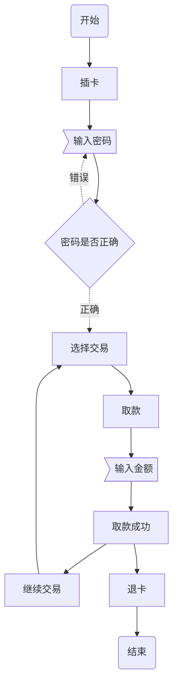

<!-- index-menu -->

# 测试用例设计方法
## 等价类划分法
### 等价类的定义

输入具有代表性的数据子集。

### 适用范围

只要存在输入的功能.

### 等价类分为
 1. `有效等价类:`满足需求的 
 2. `无效等价类:`不满足需求的
### 等价类设计步骤

#### 1、明确需求
#### 2、确定有效和无效等价类
 　　1. `有效等价类`就是题目条件(两端的极值(边界值)要判断、中间随意一个值也要判断) 
 　　2. `无效等价类`先划分与条件相反的情况，再找到特殊情况(中文、英文、符号、空格、空)
 　　3. `编写测试用例:`对于所有的无效等价类，**测试用例要尽量全覆盖**，**一条测试用例尽可能的覆盖所有有效等价类**
 　　4. 对于复杂的业务规则，对单条输入数据做拆分，然后再进行划分。**穷尽其组合**
### 举例
#### 1. 明确需求
某城市电话号码由三部分组成，分别是
>
> **地区码:** `空白或是3位数字` 
> **前缀:** `非‘0’且非‘1’开头的三位数字 `
> **后缀:** `4位数字`
> **例子：**
>    0102608828
>    2000007
#### 2.确认有效等价类和无效等价类
| 不同部分 | 有效等价类          | 无效等价类                                                   |
| -------- | ------------------- | ------------------------------------------------------------ |
| 地区码   | 空白或者3位数字     | 不是空白并且不是3位数字<br />中文、空格、空、特殊字符、小数，大小写字母，和谐词，敏感词、特殊编码字符、其他文字。 |
| 前缀     | 非0且非1开头3位数字 | 以0开头的3位数字<br />以1开头的3位数字<br />小于3位数字<br />大于3位数字<br />中文、空格、空、特殊字符、小数，大小写字母，和谐词，敏感词、特殊编码字符、其他文字。<br /> |
| 后缀     | 4位数字             | 大于四位<br />中文、空格、空、特殊字符、小数，大小写字母，和谐词，敏感词、特殊编码字符、其他文字。<br /> |

#### 3.编写测试用例

| 编号 | 用例标题                        | 测试项目 | 用例级别 | 预置条件                              | 测试输入 | 执行步骤                   | 预期结果                 | 实际结果 | 是否bug |
| ---- | ------------------------------- | -------- | -------- | ------------------------------------- | -------- | -------------------------- | ------------------------ | -------- | ------- |
| 1    | 地区码填写空白号码是否正确      | 打电话   | 高       | 前缀和后缀必须有效                    |          | 1.输入空<br />2.拨打电话   | 电话拨出成功             |          |         |
| 2    | 地区码填写三位数字号码是否正确  | 打电话   | 高       | 前缀和后缀必须有效                    | 123      | 1.输入123<br />2.拨打电话  | 电话拨出成功             |          |         |
| 3    | 前缀填写非0且非1的数字          | 打电话   | 高       | 地区码和后缀必须有效                  | 234      | 1.输入234<br />2.拨打电话  | 电话拨出成功             |          |         |
| 4    | 4位数字的后缀                   | 打电话   | 高       | 地区码和前缀必须有效                  | 1234     | 1.输入1234<br />2.拨打电话 | 电话拨出成功             |          |         |
| 5    | 地区码填写不是空白且不是3位数字 | 打电话   | 高       | 前缀和后缀必须有效                    | 12       | 1.输入12<br />2.拨打电话   | 地区码错误，电话拨出失败 |          |         |
| ...  | 穷举非等价类测试项              | 打电话   | 高       | 部分A测试非等价类，其他部分必须有效。 | ...      | 1.输入数据<br />2.拨打电话 | 电话拨出失败             |          |         |

##  边界值分析法

### 什么是边界

> **边界**是指对于`输入等价类`和`输出等价类`而言，稍高于其边界值及稍低于其边界值的一些特定情况。

### 适用范围

1. 有输入参数，且输入类型或范围长度有边界时 
2. 和等价类一起使用

### 边界值分析法

> 边界值分析法也是一种最常用的黑盒测试用例设计方法。

### 边界范围

> 确定边界情况(输入或输出等价类的边界)
> 选取正好**等于**、**刚刚好大于**和**刚刚好小于**边界值作为测试数据。
>
> 举例 1-100之间整数的和
>
> 正好等于 1 100
>
> 刚好大于 2 101
>
> 刚好小于 0 99

### 边界分析法中的三个点

- 上点 边界上的点（正好等于）1 100
- 离点 距离上点最近的点 2 101 0 99
- 内点 范围内的点  51 49

### 边界值分析法设计测试用例的操作步骤

1. 明确需求

2. 确定有效和无效等价类

   > 1、有效等价类就是题目条件(两端的极值(边界值)要判断、中间随意一个值也要判断) 
   >
   > 2、无效等价类先划分与条件相反的情况，再找到特殊情况(中文、英文、符号、空格、空)

3. 找到题目条件中的边界值

4. 编写测试用例

### 举例

#### 修改手机银行登录密码

#### 1、明确需求

> - 密码必须由字母与数字组合 
>
> - 密码长度在8~24之间(包含8和24)

#### 2、确定有效和无效等价类

**有效等价类**

> 8-24位之间数字和字母的组合

**无效等价类**

> - < 8位
>
> - \> 24位
> - 8-24位之间纯数字
> - 8-24位之间纯字母
> - 8-24位之间不是字母和数字的组合
> - 中文、空格、空、特殊字符、小数，大小写字母，和谐词，敏感词、特殊编码字符、其他文字。

#### 3、确定题目条件中的边界值

> - **上点** 8 24
> - **离点** 9 25 7 23
> - **内点** 10

#### 4、编写测试用例

| 编号 | 用例标题                           | 测试项目 | 用例级别 | 预置条件 | 测试输入   | 执行步骤 | 预期结果     | 实际结果 | 是否bug |
| ---- | ---------------------------------- | -------- | -------- | -------- | ---------- | -------- | ------------ | -------- | ------- |
| 1    | 手机银行密码输入10位数字和字母组合 | 手机银行 | 高       | 网络正常 | abcde12345 | 点击提交 | 密码格式正确 |          |         |
| 2    | 手机银行密码输入24位数字和字母组合 | 手机银行 | 高       | 网络正常 | Abc123.... | 点击提交 | 密码格式正确 |          |         |
| 3    | 手机银行密码输入23位数字和字母组合 | 手机银行 | 高       | 网络正常 | Abc123.... | 点击提交 | 密码格式正确 |          |         |
| 4    | 手机银行密码输入9位数字和字母组合  | 手机银行 | 高       | 网络正常 | Abc123.... | 点击提交 | 密码格式正确 |          |         |
| 5    | 手机银行密码输入8位数字和字母组合  | 手机银行 | 高       | 网络正常 | Abc123.... | 点击提交 | 密码格式正确 |          |         |
| 6    | 手机银行密码输入7位数字和字母组合  | 手机银行 | 高       | 网络正常 | Abc123.... | 点击提交 | 密码格式错误 |          |         |
| 7    | 手机银行密码输入25位数字和字母组合 | 手机银行 | 高       | 网络正常 | Abc123.... | 点击提交 | 密码格式错误 |          |         |
| 8    | 手机银行密码输入7位数字            | 手机银行 | 高       | 网络正常 | 123....    | 点击提交 | 密码格式错误 |          |         |

## 判定表法

### 什么是判定表法？

> 判定表法表示的是有多个输入，和多个输出，而且输入与输入之间有相互的组合关系、输入和输出之间有相互的制约和依赖关系

### 判定表的四个组成部分

> 1.**条件桩:**列出了系统的所有输入，列出的输入次序无关紧要 
>
> 2.**动作桩:**列出了系统可能采取的操作，这些操作的排列顺序没有约束 
>
> 3.**条件项:**列出针对它左列输入的取值，在所有可能情况下的真假值 
>
> 4.**动作项:**列出在输入项的各种取值情况下应该采取的动作 
>
> 5.动作项和条件项一起，指出了在条件项的各种取值情况下应该采取的动作，在判定表中贯穿条件项和动作项的一列就是一条规则，可以针对每个合法输入组合的规则设计用例进行测试

### 为什么要学习判定表法?

案例如下:

```
 若用户欠费或者关机，则不允许主被叫
```

> 前面学过的等价类划分法和边界值分析法都是着重考虑单个输入的输入条件，但是 没有考虑输入条件的各种组 合、输入条件与输出条件之间的相互制约关系。 所以要使用判定表法才能解决上述案例编写测试用例的过程

### 判定表法的适用范围

> 1、适用于有多个输入，多个输出的条件 
>
> 2、输入与输出之间有约束和因果关系的题目

###  判定表的设计步骤?

1、明确需求

2、明确条件桩 

3、明确动作桩 

4、对条件桩进行全组合 

5、明确每个组合对应的动作桩

6、设计测试用例，每列数据对应一条测试用例

### 案例

#### 1、明确需求

> 系统只接收50或100元纸币，一次只能使用一张纸币，
>
> 一次充值金额只能为50元或100元。
>
>  若输入50元纸币，并选择充值50元，完成充值后退卡，提示充值成功;
>
>  若输入50元纸币，并选择充值100元，提示输入金额不足，并退回50元; 
>
> 若输入100元纸币，并选择充值50元，完成充值后退卡，提示充值成功，找零50元; 
>
> 若输入100元纸币，并选择充值100元，完成充值后退卡，提示充值成功; 
>
> 若输入纸币后在规定时间内不选择充值按钮，退回输入的纸币，并提示错误; 
>
> 若选择充值按钮后不输入纸币，提示错误

#### 2、明确条件桩

- 输入50元纸币
- 输入100元纸币
- 充值50元
- 充值100元
- 未在规定时间内选择充值按钮
- 选择充值按钮后不输入纸币

#### 3、明确动作妆

- 完成充值退卡
- 充值成功
- 提示余额不足
- 找零50元
- 提示错误
- 退回纸币

#### 4、对条件桩进行组合

|          输入条件桩          |                输出                | 备注 |
| :--------------------------: | :--------------------------------: | :--: |
|  输入50元纸币<br />充值50元  |     完成充值退卡<br />充值成功     |      |
| 输入100元纸币<br />充值100元 |     完成充值退卡<br />充值成功     |      |
| 输入50元纸币<br />充值100元  |     提示余额不足<br />退回纸币     |      |
| 输入100元纸币<br />充值50元  |       充值成功<br />找零50元       |      |
|  未在规定时间内选择充值按钮  | 退回输入的纸币<br />提示错误<br /> |      |
|     充值按钮后不输入纸币     |              提示错误              |      |

#### 5、编写测试用例


## 因果图法

### 什么是因果图法 

`因过图法是通往判定表法的中间过程`

>  因果图法是一种利用图解法分析输入的各种组合情况，从而设计测试用例的方法，它适用于检查程序输入条件的各种组合情况

### 因果图法的核心

因果

> 1、所谓的原因就是输入，所谓的结果就是输出。 
>
> 2、因果图的“因”——输入条件
>
> 3、因果图的“果”——输出结果

案例:若用户欠费或者关机，则不允许主被叫

| 编号 |                |  1   |  2   |  3   |  4   |
| :--: | :------------: | :--: | :--: | :--: | :--: |
| 输入 |    用户欠费    |  Y   |  N   |  Y   |  N   |
| 输入 |      关机      |  N   |  Y   |  Y   |  N   |
| 输出 | 是否允许主被叫 |  N   |  N   |  N   |  Y   |

### 因果图法的适用范围

> 1、适用于有多个输入，多个输出的条件 
>
>  2、输入与输出之间有约束和因果关系的题目

### 因果图法中的基本符号

> 通常在因果图中用**C1**表示原因，用**E1**表示结果，各结点表示状态，可取值“0”或“1”。
>
>  “0”表示某状态不出现，“1”表示某状态出现。

### 因果图法的基本步骤

1、标识输入和输出

> 分析测试内容，找出其中的输入和输出并标识出来，其中要注意以下几点: 
>
> 1) 输入只涉及2种取值的，可以只作为一个标识出来，如果输入项涉及多种取值的，每个取值需要作为一个输入标识出来
>
> 2) 标识可以自己确定，但是输入和输出需要独立的标识

2、画出因果图

> 分析输入和输出之间的因果关系，输入和输入之间的约束关系，根据这些关系，画出因果图

3、 将因果图转换为判定表

> 1.将输入和输出分别写入条件桩和动作桩，并在条件项中填写输入的组合 
>
> 2.根据因果图中的输入条件约束关系，对不可能出现的输入组合，在动作项上作出删除标记 
>
> 3.根据因果图中的输入与输出的因果关系，在动作项上标出对应的动作结果

4、 生成测试用例

> 生成相应测试用例即可

## 场景法

### 什么是场景法?

场景法就是模拟用户操作软件时的场景，主要用于测试多个功能之间的组合使用情况。

### 为什么学习场景法

- 用户角度:用户平时使用的不是单个功能，而是多个功能组合起来进行使用
- 测试人员角度:平时测试的都是单个功能点进行测试，为了保证测试的全面性，也要从用户的角度出发也要对
  产品多个功能的组合进行测试。

### 场景法中两个重要的概念

#### 基本流

```
按照正确的业务流程来实现的一条操作路径
(模拟正确的操作流程)
```

#### 备选流

```
导致程序出现错误的操作流程(模拟错误的操作流程)
```

### 图片演示基本流和备选流

- **基本流**
  - 采用直黑线表示，是经过用例最简单的路径（无任何差错,程序从开始执行到结束）
- **备选流**
  - 用不同的彩色表示，一个备选流可能从基本流开始，在某个特定条件下执行，然后重新加入基本流中（如备选流1和备选流3）；也可能起源于另一个备选流（如备选流2），或者终止用例而不再加入到某个流（如 4、2）


#### 场景法的适用范围

1、多个功能间的组合测试 

2、在冒烟测试时主要采用场景法进行测试

### 场景法测试用例步骤

#### 1、明确需求

> 用户**进入一个在线购网站**进行购物，**选购物品**后，进行在线购买，这时需要使用**账号登录**，登录成功后，进行**付钱交易**，交易成功后，**生成订购单**，完成整个购物过程。

#### 2、确定基本流和备选流 

`基本流：` 进入网站 **->** 选择物品 **->** 登陆账号 -> 付款 -> 生成订单

`备选流1：` 账户不存在

`备选流2:` 账户密码错误

`备选流3:`用户账户余额不足

`备选流4` 用户账户没钱

#### 3、根据基本流和备选流确定场景 

`场景1：` 成功购物:基本流

`场景2：` 账号不存在:基本流，备选1

`场景3：` 账号密码错误:基本流，备选2

`场景4：` 账户余额不足:基本流，备选3

`场景5:`  账户没钱，基本流，备选4

#### 4、一条场景就是一条测试用例

| 编号 | 预置条件 |           输入           |                             步骤                             |                      预期输出                      |
| :--: | :------: | :----------------------: | :----------------------------------------------------------: | :------------------------------------------------: |
|  1   | 网络正常 |      正确的操作流程      | 1. 访问网站<br />2.选购物品<br />3.账号登陆<br />4.付款<br />5.生成订单 | 1.账号登陆成功<br />2.付款成功<br />3.生成订单成功 |
|  2   | 网络正常 | 输入错误的用户名进行测试 |      1. 访问网站<br />2.选购物品<br />3.账号登陆<br />       |                 1. 提示账号不存在                  |
|  3   | 网络正常 |  输入错误的密码进行测试  | 1. 访问网站<br />2.选购物品<br />3.账号登陆<br />4.付款<br />5.生成订单 |     1. 提示账户密码错误，<br />返回基本流步骤3     |

## 流程图法

### 什么是流程图法

流程分析法主要是针对测试场景类型属于流程测试场景的测试项下的测试子项进行设计。

### 流程图法的适用范围

1、多个功能间的组合测试 

2、在冒烟测试时主要采用流程图法进行测试

### 流程图法设计测试用例步骤

#### 1、详细了解需求; 

#### 2、根据需求说明或界面原型，找出业务流程的各个页面以及各页面之间的流转关系; 

#### 3、画出业务流程(产品经理使用*Axure*软件制作); 

#### 写用例，覆盖所有的路径分支。




## 错误推测法

### 什么是错误推测法？

```
错误推测法是指利用直觉和经验猜测出出错的可能类型，有针对性列举出程序中所有可能的错误和容易发生错误的
情况，它是测试经验丰富的测试人员喜欢使用的一种测试用例设计方法。
```

#### 基本思想:

```
基本思想是列举出可能犯的错误或错误易发生的清单，然后根据清单编写测试用例;
这种方法很大程度上是凭经验进行的，
即凭人们对过去所作测试结果的分析，对所揭示缺陷的规律性作直觉的推测来发现缺陷。
```

#### 使用场景:

```
项目紧任务急、时间不够，这时就不要按部就班的测试了，
根据之前项目的经验，找到之前出错过的类似模块进行重点测试;
所有正常测试结束后，通过错误推断法再测试一些之前出过问题的模块。
```

## 正交法

### 什么是正交法？

正交排列法就是能够使用最小的测试过程集合获得最大的测试覆盖率。

### 适用范围

```
当可能的输入数据或者输入数据的组合数量很大时，由于不可能为每个输入组合都创建测试用例，可以采用这种方法。
1、两两之间进行组合测试的场景 
2、测试输入数据很大或者输入数据的组合数量很大时
```

`特点:`均匀分散，齐整可比。

### 正交表的概念

一种特制的表，一般的正交表标记为:Ln(mk) n表示行数，也就是需要测试组合的次数

k是表的列数，表示控件的个数(因素的个数，或是因子个数) 

m是每个控件包含的取值个数(各因素的水平数，即各因素的状态数)

如: L9(34)

> 有4个控件 
>
> 每个控件有3个取值 
>
> 9为需要测试的组合个数 
>
> 叫4因素3水平

#### 使用步骤

1、根据需求形成因子状态表----->因子:控件名称 状态:每个控件对应的取值 

2、确定所采用的正交表
3、将正交表中的字母用文字代替
4、一行就是一条测试用例

#### 因子数不相同

没有符合的正交表时，可以采用因素数**>=5**的

### 状态数不同

当正交表中状态数不同时，选择状态数出现最多的**--->**所以应该选择状态 数为**3**的正交表，因素数选择>=**3**

`最小状态数在补充时，应该统一为一个状态`

## 总结

测试用例设计方法

(1)如果测试一个功能中有输入功能，没有输入的组合情况，可以使用等价类划分法 (2)如果测试一个功能中有输入功能，且输入类型或者范围长度有边界时，可以使用边界值法。

(3)如果测试一个产品，有多个输入，多个输出，而且输入与输入之间有相互组合关系，输入和输出之间有相互 制约和依赖关系可以使用因果图和判定表法

(4)对于参数配置类的软件，需要考虑参数之间相互组合的情况，用最少的测试用例获得最大的测试覆盖率，可 以使用正交试验法

(5)对于多个功能之间的组合逻辑测试，可以使用场景法和流程图法。

 (6)采用错误推断法再追加测试用例——依靠测试工程师的经验和智慧。